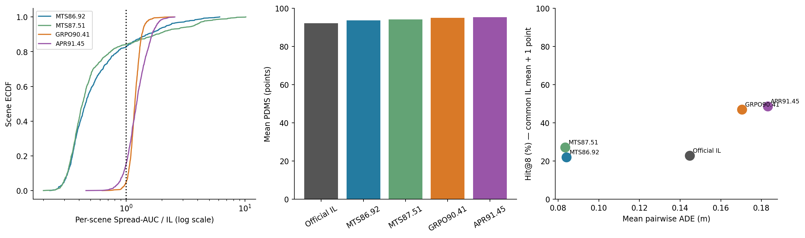
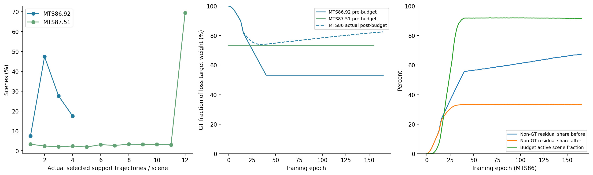
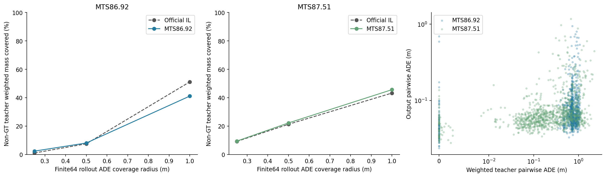
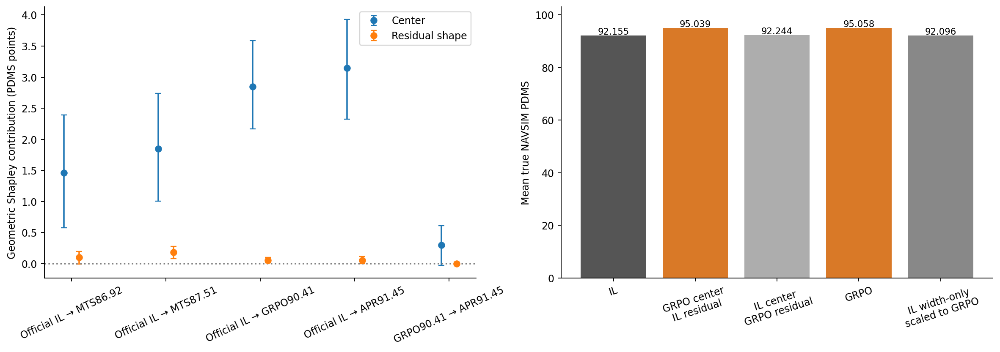
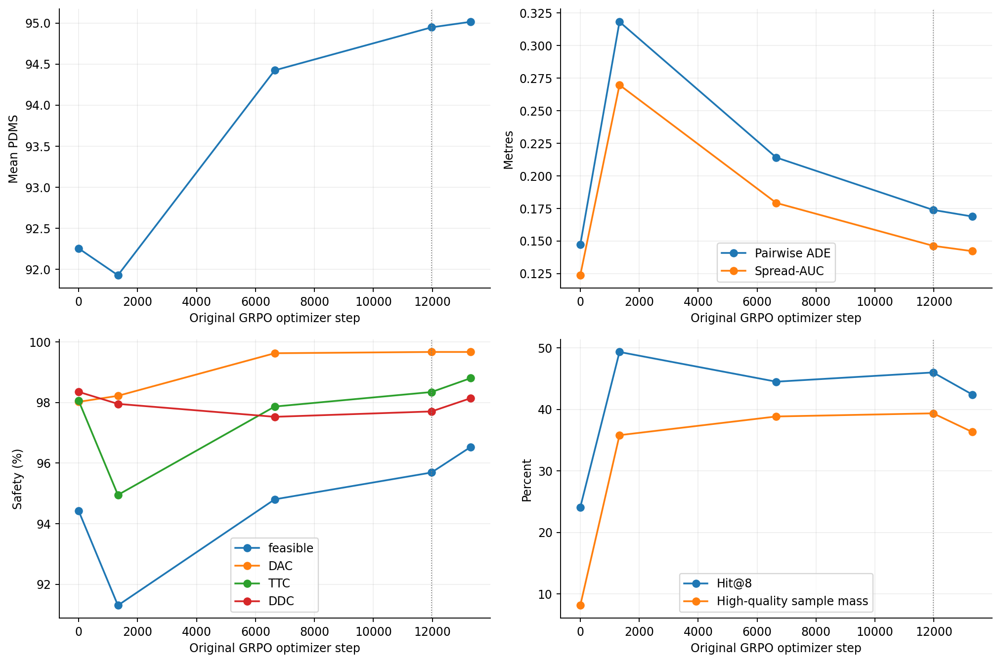
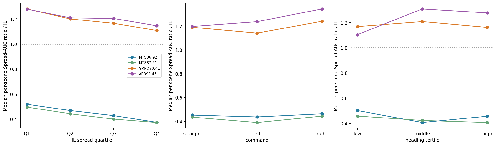

# 五checkpoint：输出分布、真实多候选训练数据与GRPO变化

完成状态：**COMPLETE（1000/1000场景，缺失0；本轮权重更新0）**。

分支：`analysis/five-checkpoint-training-distribution-20260913`。实际parent：`7dd3a700830aace6f399e35faf923def48a28699`。
冻结配置SHA256：`f0a5ab7d74a077dd58bcf5fbb38361ba79eb1ee79af39164ab5932fe3574d98a`；时间：`2026-09-13T23:36:34.781312+00:00`。
这是在已知V1现象之后开展的探索性跟进；新增指标、对照、场景和种子在本次新分析前冻结，不将其描述成对V1结论不知情的预注册验证。

## 1. 直接回答

**两次Multi-SFT的实际输出更集中、更接近GT，并提高了本1000场景的平均质量与安全性；但没有证据表明它们普遍增加了对非GT teacher的覆盖。** 数据确实包含多条、且往往更高分的teacher，但训练中的监督质量分布高度偏向GT。不能从“teacher更多”推出“生成模式更多”。

**官方IL→90.41的主要变化，是轨迹中心迁移到更高质量的位置，同时随机分布适度变宽。** 新增真实NAVSIM几何交换对照把+2.9034分中的约+2.8493分分配给中心变化、+0.0542分分配给围绕中心的残差形状变化。中心贡献约98.1%是本对照的几何归因，不能冒充训练过程的严格因果百分比。仅扩大IL随机幅度反而−0.0585分。

**APR91.45不能当作“90.41继续执行相同GRPO”的终点。** 它还包含不同RL基底、offline teacher refinement、保留损失及参数残差合并。APR比90.41更宽，但在本1000场景上的+0.2972分差异，95%场景配对区间包含0。

## 2. 实验设计与证据边界

- 固定沿用V1按驾驶指令分层随机抽取的1000个Navtrain场景：straight634、left251、right115，来自512个log，不替换或删除场景。
- 五模型每场景都使用**64条**真实随机输出，共320,000条。共享观察特征和随机数：DDIM、5步、eta=1、temperature=1、FP32评测，原生模型归一化保留。轨迹统一为ego局部4秒、8个0.5秒同步未来点，包含XY米与heading弧度，**不包含t=0**。
- 本次复用已验证的上述真实缓存；额外小规模GPU重新采样核验运行路径，新增716,800条真实NAVSIM评分，用于中心/残差交换、幅度对照和真实训练teacher。没有重新生成五模型全量采样，没有进行任何SFT或GRPO更新。
- 主质量指标统一为NAVSIM-v1 PDMS，报告0–100分；保守可行要求NC、DAC、TTC、DDC全部为1。hard failure只定义为NC或DAC不满1；Comfort另外报告。
- 每个指标先逐场景计算，再1000场景等权汇总。主要差值提供3000次scene-paired bootstrap和3000次log-cluster sensitivity。缺乏两个高质量样本的场景，其高质量多样性为NA，明确给出配对交集分母，不填0。
- 当前研究的是**checkpoint部署时evaluation采样分布**，不是历史GRPO训练时的探索分布。真实GRPO `sample_chain` 的噪声floor/clip与evaluation `get_action`不同，不能把本64条样本与上一轮native-GRPO mass audit混用。
- 全部为Navtrain内部机制诊断；两次MTS的真实训练档案均覆盖这1000个token。不是untouched Navtest泛化检验。名称中的86.92/87.51/90.41/91.45是历史checkpoint标识，不能与下面新协议的均分直接相减。

分布宽度用pairwise ADE与Spread-AUC（8时刻XY标准差向量模长的平均）衡量；中心位移用两组样本XY均值轨迹的ADE。另保留V1 medoid中心位移字段，但不混称同一量。宽度不等于驾驶语义模式数量，也不等于生成概率或likelihood。

主HQ定义为：保守可行，且PDMS≥本场景official IL的64样本均分+1。Hit@8计算64样本中8个固定、不重叠的8次evaluation抽样块内至少一个HQ的比例；这些块**不是native GRPO group**。354/1000场景的阈值超过100，所有模型均不可能命中；主表保留这些场景。这是共同参照，不因模型表现变更。旧V1以单条IL reference定义的Hit保留为`Hit8_legacy`，不与新Hit混用。

## 3. 五模型的同场景结果

| model | PDMS | 保守可行率% | Pairwise ADE(m) | 全局宽度/IL | 平均中心位移(m) | HQ样本比例% | Hit@8% |
| --- | --- | --- | --- | --- | --- | --- | --- |
| official_il | 92.1547 | 93.9359 | 0.1448 | 1.0000 | 0.0000 | 8.1547 | 22.9250 |
| mts_8692 | 93.7139 | 96.7625 | 0.0841 | 0.5805 | 0.4128 | 18.6328 | 21.9750 |
| mts_8751 | 94.1829 | 96.7641 | 0.0835 | 0.5765 | 0.4624 | 22.1328 | 27.1625 |
| grpo_9041 | 95.0581 | 94.6359 | 0.1705 | 1.1774 | 0.4990 | 40.6375 | 47.0375 |
| apr_9145 | 95.3553 | 95.6797 | 0.1831 | 1.2644 | 0.8028 | 44.4438 | 48.6250 |

主表来自`metrics/policy_summary.csv`；原始5000场景行位于`policy_scene.csv`。所有比例先逐场景计算。细分的NC/DAC/TTC/DDC/EP、CVaR20、oracle64、GT距离和横纵向标准差也在同表。

相对IL的pairwise ADE变化：MTS86 **−41.95%**，MTS87 **−42.35%**，GRPO **+17.74%**，APR **+26.44%**。MTS86/87分别在827/1000、842/1000场景更集中；典型场景的Spread-AUC比值中位数为0.4529/0.4277。不能把“全局均值之比”与“逐场景比值的均值/中位数”混成一个数字。

质量变化及95%CI：

- MTS86−IL：+1.5592 [+0.6171, +2.5249]，配对场景n=1000。
- MTS87−IL：+2.0282 [+1.2248, +2.9068]，配对场景n=1000。
- GRPO−IL：+2.9034 [+2.2182, +3.6710]，配对场景n=1000。
- APR−IL：+3.2006 [+2.4319, +3.9835]，配对场景n=1000。
- APR−GRPO：+0.2972 [-0.0254, +0.6178]，配对场景n=1000。

宽度收缩没有意味着所有指标更差。MTS86的Hit@8差值-0.0095 [-0.0320, +0.0115]，配对场景n=1000（比例单位，非百分点），没有明确改善；MTS87则为+0.0424 [+0.0204, +0.0670]，配对场景n=1000。两者HQ样本比例都明显增加。也就是说，跨场景“更稳定地产生某种较好行为”和“8次抽样能在更多场景找到更好的行为”是两件事。

GRPO的HQ样本比例从8.15%到40.64%，Hit@8从22.93%到47.04%。平均样本与本模型oracle64之间的质量差从2.5135缩小到0.8810分，最差20%采样的均分从89.7309提高到94.4265。这更接近于**把概率质量移到较好行为上，并减少差采样**，而非只靠偶然抽到极端高分轨迹。

## 4. 找到的真实训练数据：哪些轨迹确实参与了监督

MTS86的support archive：
`/mnt/project/VLA-AD_last_vla_dev/outputs/sg_fps_v6_full_training_20260713T1648Z/support_v6`

MTS87的support archive：
`/mnt/project/VLA-AD_last_vla_dev/outputs/sg_fps_support_semantic_full_20260705T032521Z/reselect_ref_relative_feasrelax_gtimprover_20260705T185120Z/support_v3`

每个记录文件是`sha1(token).pkl.xz`。逐条读取原始`support_indices`，只将实际选中的support当作训练目标；原始候选计数与选中目标计数分开。2000个真实记录均找到；总计42,796/23,306条原始候选，实际support2,551/10,249条。本1000场景的选中support中未发现完全相同的重复轨迹。

| model | raw_count | support_count | expected_GT_mass_pre_budget | target_ESS | weighted_pair_ADE | teacher_best_PDMS | GT_only_scenes | GT_absent_selected_scenes |
| --- | --- | --- | --- | --- | --- | --- | --- | --- |
| mts_8692 | 42.7960 | 2.5510 | 0.5375 | 2.2802 | 0.6999 | 97.0491 | 75 | 0 |
| mts_8751 | 23.3060 | 10.2490 | 0.8833 | 1.2863 | 0.3999 | 99.0175 | 33 | 5 |

`expected_GT_mass_pre_budget`是按当前可审计原生helper、实际训练配置与checkpoint epoch重建的**采样后、残差预算之前的期望监督权重**，不是target出现频率，也不是模型生成概率。`target_ESS`是这些权重的有效样本数。A5的5个场景所选support里没有GT，按历史实现使用可用anchor/best规则；没有事后注入GT。GT质量参照从独立核验过的exact-GT评分取得，故1000场景参照完整。

来源计数及重建监督质量分配：

| model | source_bucket | selected_support_count | selected_scene_count | expected_loss_mass_pre_budget_per_scene | selected_PDMS_pooled |
| --- | --- | --- | --- | --- | --- |
| mts_8692 | external | 272 | 272 | 0.1062 | 97.4367 |
| mts_8692 | gt | 1000 | 1000 | 0.5375 | 94.8783 |
| mts_8692 | lateral | 161 | 156 | 0.0286 | 94.3727 |
| mts_8692 | policy | 0 | 0 | 0.0000 | NA |
| mts_8692 | progress | 762 | 758 | 0.2484 | 96.5978 |
| mts_8692 | timing | 356 | 356 | 0.0792 | 94.4096 |
| mts_8751 | external | 6908 | 906 | 0.0954 | 98.7183 |
| mts_8751 | gt | 995 | 995 | 0.8833 | 94.9349 |
| mts_8751 | lateral | 456 | 216 | 0.0020 | 99.7226 |
| mts_8751 | progress | 1517 | 586 | 0.0173 | 96.7421 |
| mts_8751 | timing | 373 | 288 | 0.0020 | 97.3622 |

上表source质量均值是来源内描述性候选均值，不是各场景等权的模型质量。`external`来自档案中的真实DDV2/DriveOR等source字符串（包括它们的已标明派生轨迹），完整标签在`teacher_candidates_scored.parquet`；没有重命名其他checkpoint输出来伪造外部来源。

### 4.1 必须修正训练关系的理解

两次`train_args.json`都记录`agent.checkpoint_path=""`、`allow_random_init=true`，使用缓存的官方VLM特征、planning adapter与FS-Norm。**它们不是从这个released official IL action-head权重直接微调得到的配对版本**。两者训练200 epochs，取epoch165/155；LR1e-4，实际batch16×8，mixed16训练，评测转换FP32。约4244万可训练参数；没有完整VLM的在线更新。

因此，MTS相对IL的变化同时混合了初始化、action-head/adapter结构、归一化、数据与训练recipe差异。数据/日志提供了合理机制线索，但不能把所有收缩归因于“多轨迹SFT”这一个因素。要做严格因果判断，还需同初始化、同结构、同归一化、同计算预算的GT-only与multi-target对照；本轮不启动训练。

### 4.2 损失怎样定义，为什么更多teacher不一定更宽

两次都是原生diffusion SFT，不是让模型在一次输出里同时回归所有teacher，也不是直接对PDMS反向传播。对所采样的target先做该模型的trajectory normalization，采样原生t和高斯ε，构造`x_t=α_t x0+σ_t ε`，训练预测ε。主要损失是：

`L_diff = Σ_(scene,target) w_adjusted · mean[(εθ(x_t, observation, t)−ε)^2] / Σ w_adjusted`。

再加配置中固定的`0.05 × trajectory_aux + 0.01 × feasibility_aux`（10-epoch ramp）；这里不是用PDMS当可微loss。记录的pairwise-ranking、invalid-repulsion、preference-DPO损失为0，没有显式让输出熵增大或强制覆盖每个teacher的目标。

**MTS86 / V6：** 每次最多GT+1条非GT target。非GT在可用mode内按原生mode balancing和teacher confidence抽样；40epoch内β爬升到0.5，GT/teacher共享t与ε。随后启用固定0.35的非GT残差质量预算。记`A=Σ_GT w√L`、`B=Σ_nonGT w√L`，将非GT权重乘以`min(1, 0.35 A / (0.65 B))`，再保持每场景总权重归一化。它约束的是加权残差proxy，**不是实际梯度范数上界**。

epoch165的真实训练日志给出：非GT目标weight从**46.81%降到17.50%**；约91.71%场景触发预算。非GT/GT target loss比约4.67；非GT weighted residual share从67.44%变成33.19%。最终监督明显受GT主导。这些是历史TensorBoard实测，不能用重建的静态β=0.5取代它们。

**MTS87 / A5：** 档案平均有10.249条support，但每次最多抽4条，强制anchor/best，再按权重无放回采样，并对被选中权重重新归一化。β是依赖support计数、距离、source熵和reward gap的自适应量；epoch155真实日志平均β≈0.2709，GT权重（抽target之前）≈73.50%。本1000场景重建的抽样后GT期望权重进一步达到88.33%，因为强制anchor与子集再归一化。该88.33%不是训练日志直接观测的数；native sampler Monte Carlo与精确无放回枚举通过核验。A5没有V6的residual budget。

原始Python训练快照没有完整保留；本轮保留了可用native helper文件hash、真实训练参数、commands日志来源和TensorBoard，重建权重与实际记录近似一致，但不声称获得每个历史optimizer step的精确target权重。尤其V6的历史post-budget逐target权重无法从静态档案恢复，所以它只用实际训练日志报告。

### 4.3 模型究竟学到了teacher的哪部分

以每场景64条采样能否落在某teacher的0.5m ADE内衡量有限样本几何覆盖；按训练期望权重加权，而不是把每个目标等权。结果：

|训练档案|全部teacher：IL→MTS|仅非GT teacher：IL→MTS|非GT配对场景数|
|---|---:|---:|---:|
|V6 / 86.92|51.69% → 57.34%|7.54% → 8.09%|925|
|A5 / 87.51|80.46% → 90.41%|21.28% → 22.23%|967|

非GT覆盖增益的场景配对95%CI：V6 **−1.58至+2.58个百分点**，A5 **−0.48至+2.35个百分点**；均包含0。全部teacher覆盖的增益则是+5.66pp、+9.94pp，区间均大于0。完整0.25/0.5/1.0m结果见`teacher_coverage_paired.csv`与Fig3。

MTS86/87平均到GT的ADE从IL的0.3938m降到0.1807/0.2265m。结合实际监督权重，这支持“主要巩固GT附近行为、没有广泛复现更远teacher”的解释。**不等价于teacher不可学，也不等价于SFT完全无效。** 64条有限样本不能排除很稀少的输出；权重重建在预算之前，也不能作为生成概率校准。

收缩在IL原本最宽的场景最强：

| model | stratum | n | median_spread_ratio | compressed_scene_fraction |
| --- | --- | --- | --- | --- |
| mts_8692 | Q1 | 250 | 0.5199 | 0.8080 |
| mts_8751 | Q1 | 250 | 0.4968 | 0.8040 |
| mts_8692 | Q2 | 250 | 0.4695 | 0.8120 |
| mts_8751 | Q2 | 250 | 0.4439 | 0.7920 |
| mts_8692 | Q3 | 250 | 0.4295 | 0.8520 |
| mts_8751 | Q3 | 250 | 0.4013 | 0.8680 |
| mts_8692 | Q4 | 250 | 0.3751 | 0.8360 |
| mts_8751 | Q4 | 250 | 0.3736 | 0.9040 |

在Q4，MTS86/87典型宽度分别剩IL的37.51%/37.36%。直行、左转、右转均出现收缩；MTS87左转中位数比值0.3907、GT heading-change高组0.4069。不能仅把全局平均解释成所有scene同幅度收缩。不同teacher数量组也都存在收缩，见`teacher_availability_stratification.csv`。

## 5. 官方IL→90.41：真实GRPO到底改变了什么

已经找到正式训练run，且原始`epoch=8-step=11970.ckpt`与90.41 watcher保存权重的**SHA256完全一致**，不是仅凭文件名猜训练链。初始化与冻结reference都是当前official IL。证据见`audits/grpo_9041_lineage.json`。

归档实现的`forward_grpo`每场景采8条链，真实评分后在组内计算`A=(r−mean(r))/(std(r)+1e-8)`，再对链上denoising transition的log-prob加权：`L_policy=−mean(A × γ^step × logp)`，γ=0.6；同时加入0.1权重的冻结old-policy采样链BC约束。该归档实现没有在这里显式最大化轨迹熵；不要凭算法名称套成另一种PPO ratio或KL loss。原生代码保存于manifest记录的归档路径，`forward_grpo`约819行，loss约872行。

正式training scorer的progress/TTC/comfort权重为10/5/2，统一evaluation scorer为5/5/2；DDC在该fork中是权重为0的单独诊断项。优化目标对progress更偏重，可解释为何必须单独检查方向与安全代价，而不只看标量分数。

在最终90.41的1000场景evaluation分布中：

- 平均轨迹中心移动0.4990m；到GT的平均距离**增加**到0.6503m，但PDMS提高。因此GT几何距离不是质量的同义词。
- 横向/纵向spread从0.0317/0.1158m变成0.0371/0.1372m，两个方向均适度变宽。不是简单“所有轨迹更激进地往前开”：沿GT切向的平均有符号位移约−0.0996m，而归一化EP提高，两者定义与场景平均不同。
- 在IL和GRPO均有至少两条HQ样本的239个配对场景，HQ pairwise ADE增加0.0755m，95%CI约[0.0703,0.0806]。这为“高质量行为中的有用多样性提高”提供额外证据，不能用所有候选的宽度替代它。

安全与progress变化（下表差值/区间均为百分点，win fraction也乘100）：

| metric | mean | ci_low | ci_high | win_fraction |
| --- | --- | --- | --- | --- |
| feasible | 0.7000 | -0.3814 | 1.7893 | 7.8000 |
| hard_failure | -1.3109 | -2.0564 | -0.6061 | 0.3000 |
| EP | 4.5282 | 3.7313 | 5.3208 | 56.0000 |
| NC | -0.0219 | -0.4813 | 0.3937 | 0.6000 |
| DAC | 1.4656 | 0.8875 | 2.0705 | 3.9000 |
| TTC | 0.6141 | -0.1500 | 1.3594 | 4.4000 |
| DDC | -0.9047 | -1.4875 | -0.4031 | 0.3000 |

EP提高4.53pp，DAC提高1.47pp；DDC反而下降0.90pp且区间不包含0。保守可行率+0.70pp的区间包含0。**不能称为所有安全维度都改善。**

### 5.1 真实NAVSIM的中心与残差交换对照

每场景写作`trajectory = center + residual`。中心使用XY逐时刻均值，heading用circular mean；heading残差wrap至合法角度。对旧模型A、新模型B实际构造并评分四种组合：

1. A中心+A残差：原A输出；
2. B中心+A残差：只换中心；
3. A中心+B残差：只换随机偏差形状；
4. B中心+B残差：原B输出。

所有组合保留同步未来时刻；当前ego pose/t=0未作为可移动轨迹点。没有用分数插值。用两种替换顺序的平均边际贡献（两因子Shapley）分解总质量差，逐场景加和严格等于总差。

| contrast | effect | mean | ci_low | ci_high |
| --- | --- | --- | --- | --- |
| grpo_9041__apr_9145 | total_gain | 0.2972 | -0.0383 | 0.6268 |
| grpo_9041__apr_9145 | center_contribution | 0.2962 | -0.0316 | 0.6097 |
| grpo_9041__apr_9145 | residual_shape_contribution | 0.0010 | -0.0231 | 0.0271 |
| official_il__apr_9145 | total_gain | 3.2006 | 2.4220 | 3.9977 |
| official_il__apr_9145 | center_contribution | 3.1473 | 2.3271 | 3.9308 |
| official_il__apr_9145 | residual_shape_contribution | 0.0533 | -0.0047 | 0.1150 |
| official_il__grpo_9041 | total_gain | 2.9034 | 2.1922 | 3.6280 |
| official_il__grpo_9041 | center_contribution | 2.8493 | 2.1643 | 3.5901 |
| official_il__grpo_9041 | residual_shape_contribution | 0.0542 | 0.0114 | 0.1016 |
| official_il__mts_8692 | total_gain | 1.5592 | 0.6203 | 2.5268 |
| official_il__mts_8692 | center_contribution | 1.4620 | 0.5732 | 2.3921 |
| official_il__mts_8692 | residual_shape_contribution | 0.0972 | -0.0083 | 0.1980 |
| official_il__mts_8751 | total_gain | 2.0282 | 1.2099 | 2.8750 |
| official_il__mts_8751 | center_contribution | 1.8482 | 1.0021 | 2.7367 |
| official_il__mts_8751 | residual_shape_contribution | 0.1800 | 0.0806 | 0.2771 |
| official_il__width_only | total_gain | -0.0585 | -0.0917 | -0.0254 |

其中IL→GRPO的四组合均分约92.1547、95.0393、92.2442、95.0581。只把IL residual XY幅度缩放至GRPO的Spread-AUC、保留IL中心及heading的额外对照，均分约92.0962，变化−0.0585，95%CI[−0.0917,−0.0254]。

这说明**GRPO的增益不能靠“把IL采样撒得更开”复制**。不过center/residual交换产生的是离线几何反事实轨迹，不保证能由某个真实网络直接采样；residual shape还包含方向、相关性和高阶形状，而非仅方差。因此“98.1%”只能称该交换对照的中心归因，不能称严格隔离的GRPO训练因果效应。

## 6. 历史GRPO中间权重：变化不是单调的

固定沿用V2结果无关hash选择的300个场景，每snapshot使用32条同CRN采样；加入用户指定11970 checkpoint的V1前32条。原始链为step0/1330/6650/11970/13300，不按新PDMS挑最好的snapshot。

| step | PDMS | feasible | pairwise_ADE | Spread_AUC | mean_center_shift | HQ_mass | Hit8 |
| --- | --- | --- | --- | --- | --- | --- | --- |
| 0 | 92.2523 | 0.9442 | 0.1471 | 0.1236 | 0.0000 | 0.0813 | 0.2408 |
| 1330 | 91.9262 | 0.9130 | 0.3182 | 0.2697 | 0.5258 | 0.3580 | 0.4933 |
| 6650 | 94.4229 | 0.9480 | 0.2140 | 0.1791 | 0.5570 | 0.3884 | 0.4450 |
| 11970 | 94.9466 | 0.9569 | 0.1738 | 0.1462 | 0.4913 | 0.3935 | 0.4600 |
| 13300 | 95.0144 | 0.9653 | 0.1687 | 0.1421 | 0.4344 | 0.3632 | 0.4242 |

这一轨迹很关键：早期1330步pairwise ADE从0.1471变为0.3182m，**宽度增加一倍以上，但均分92.2523→91.9262，安全也下降**；随后训练到6650/11970/13300，分布收回到0.2140/0.1738/0.1687m，质量升到94.42/94.95/95.01。

因此，正式训练本身也可能短暂退化；原版IL并非GRPO每一步都提升。这里复用的是历史成功的正式长程训练链，**不是之前已发现recipe问题的micro-GRPO wrapper实验**。短期降分不能自动证明GRPO最终失效，也不能把错误wrapper结果当成这条正式链的证据。300场景均分不能与1000场景均分直接混比。

## 7. APR91.45应如何解释

最终checkpoint manifest在`/mnt/project/VLA-AD/outputs/pdms914497_reverse_conflict_residual_trust105_scale14p3_20260727/reverse_conflict_residual_scale14p3.ckpt.manifest.json`。它声明`θ_final=θ_base−14.3(θ_conflict−θ_base)`；该14.3作用于一个已构建的局部参数差，不是把整个网络权重乘14.3。此处“参数残差”与前一节的**轨迹残差**完全不同。

历史APR/IPR审计追溯到约91.0834的Pareto-GRPO基底，之后有Navtrain外部teacher、AWAC/保留损失、teacher refinement及参数残差分支合并。不能把它与90.41排成同一原始GRPO算法的直接连续因果链。外层checkpoint/merge系数的promote选择曾使用Navtest反馈；最终91.45不能被当作完全未触及的测试泛化证据。本次1000场景也仅作内部机制诊断。

APR输出比IL更宽、中心移动更大（0.8028m），effective covariance rank从IL1.67变成APR3.00，高质量样本覆盖进一步提高。但APR相对90.41的PDMS变化+0.2972 [-0.0254, +0.6178]，配对场景n=1000；Hit8变化+0.0159 [-0.0018, +0.0341]，配对场景n=1000。在本样本上不应把这两个增量写成已明确成立的提升。

## 8. 可靠性、复现与可用于论文的表述

64样本主结论与16/32前缀检查一致：MTS pairwise ADE始终约0.083–0.084m，IL约0.145m，GRPO约0.171m，APR约0.183m。MTS的Spread-AUC对稀有长尾更敏感，例如MTS87在16/32/64样本为0.0865/0.0898/0.0996m；所以应保留64条主分析，不据此声称每场景尾部概率已精确估计。详见`sample_count_reliability.csv`。

本轮重新加载五个真实checkpoint，在每模型固定8场景×16抽样上核验当前运行代码、随机流与权重/缓冲区未变化，记录如下：

| model | max_trajectory_abs_error | bitwise_cache_match |
| --- | --- | --- |
| official_il | 0.00000000 | True |
| mts_8692 | 0.00000000 | True |
| mts_8751 | 0.00000000 | True |
| grpo_9041 | 0.00000000 | True |
| apr_9145 | 0.00000000 | True |

fresh replay与旧缓存的最大PDMS差为0.000000000 point，五模型最终均逐位一致。初次审计额外将`requires_grad`统一关闭，产生≤3.815e-6的FP32差异；只恢复输出float cast未消除差异，保持原生module flags之后恢复精确相等。整个过程使用`inference_mode`且没有optimizer，权重/缓冲区始终不变；初次审计记录保留，没有放宽容差。旧缓存始终保留为主统计，未被fresh replay替换。当前运行内相同随机流的重复采样误差为0。batch/scalar真实NAVSIM评分在原轨迹与新几何反事实上均通过≤1e-8核验。

测试包括中心交换保持pairwise距离、circular heading重构、Shapley可加性、幅度控制精确匹配spread、PDMS单位/HQ定义、原生target sampler期望与Monte Carlo一致、残差预算proxy、真实GT身份与冻结协议。最终审计核验799个历史受保护文件和全部checkpoint hash未改变。所有实现修复与初次replay检查记录保留于`audits/`，没有按科学结果调threshold或换场景。

|结论|状态|最保守解释|
|---|---|---|
|两个MTS checkpoint相对IL更集中|SUPPORTED|本1000场景、统一evaluation采样下稳定成立|
|多candidate训练已广泛扩展非GT teacher行为覆盖|NOT SUPPORTED|非GT覆盖增益CI含0；更多目标不等于更多输出模式|
|收缩就是MTS性能恶化|NOT SUPPORTED|本样本MTS均分和安全提高，MTS87 Hit8也提高|
|监督强GT权重与收缩有关|PARTIALLY SUPPORTED|真实日志/数据支持机制线索，初始化/结构等混杂尚未隔离|
|官方IL→正式GRPO提高高质量行为的采样质量分配|SUPPORTED|直接训练链、场景配对质量和HQ覆盖改善|
|GRPO仅靠增大宽度提升|NOT SUPPORTED|width-only负收益；几何中心交换解释绝大部分增益；历史宽度非单调|
|GRPO所有安全指标同时改善|NOT SUPPORTED|DDC下降；保守可行率提升区间含0|
|APR−90.41的全部差异来自同一GRPO链|NOT SUPPORTED|训练谱系不同，APR还有teacher/参数合并|
|多teacher监督自身导致压缩的严格因果效应|UNTESTED|需同初始化/同结构/同预算GT-only控制|

建议论文表述：**“在统一随机推理协议下，两个多目标监督checkpoint相较released IL表现出更集中的输出，且有效监督权重与行为覆盖仍明显偏向GT。经核验的IL→GRPO链提高了高质量行为的采样质量分配；离线中心/残差交换显示，这种提升主要关联于行为中心迁移，而非单纯扩大随机幅度。轨迹宽度本身不是性能优劣的充分指标。”**

本轮不支持“多轨迹SFT必然扩展support”“RL必然使分布更尖”“更宽就更好”，也没有进行新的SFT/GRPO因果验证。

## 文件入口

所有新增结果：`outputs/five_checkpoint_training_distribution/`。

- 配置：`configs/five_checkpoint_training_distribution/primary.yaml`。
- 完整训练/权重/源代码身份：`manifests/models_and_training.json`、`teacher_records.json`、`historical_grpo_inputs.json`。
- 主表与CI：`metrics/policy_summary.csv`、`paired_comparisons.csv`。
- 真实teacher及统一重评分：`metrics/teacher_candidates_scored.parquet`、`teacher_output_scene.csv`、`teacher_coverage_paired.csv`。
- 原始训练记录：`metrics/historical_training_curves.csv`、`historical_training_at_checkpoint.csv`。
- 几何交换：`metrics/counterfactual_scene.parquet`、`counterfactual_summary.csv`。
- 历史真实GRPO链：`metrics/historical_grpo_scene.csv`、`historical_grpo_paired.csv`。
- 六张核心图：`figures/Fig1_width_quality`、`Fig2_actual_teachers_weights`、`Fig3_teacher_to_output`、`Fig4_center_residual_counterfactual`、`Fig5_historical_GRPO_evolution`、`Fig6_scene_stratification`，均有PNG/PDF/SVG和CSV源数据。
- 可交互同场景查看器：`figures/same_scene_viewer.html`，可切换六个预定场景、五模型全部64条输出与真实teacher。
- 本地新增评分缓存：`cache/scored/`，只保存到本机；轨迹由原始缓存、teacher路径与原样几何组合函数可重建。不提交大缓存、feature或checkpoint。
- 测试审计：`audits/`与`manifests/run_summary.json`。复现命令见新工具目录README。

发布存储：大于3MiB的四张逐行CSV在本地保留，远程提交无损同名Parquet（含所有行/列）；其余表提交CSV。映射和行数见`manifests/metric_storage.json`。

## 核心图预览

