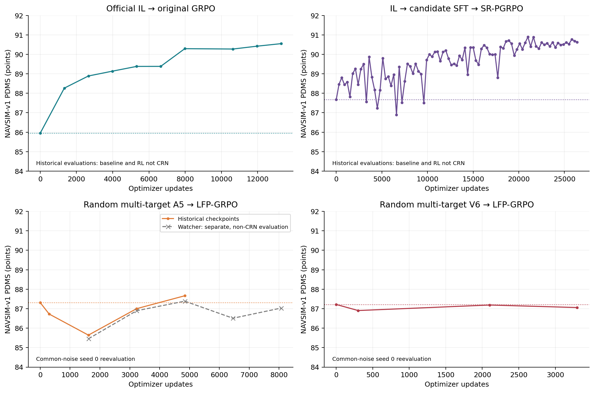
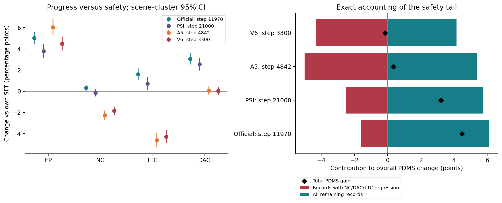
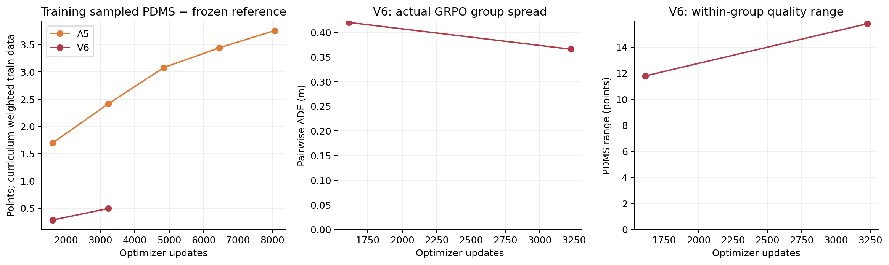

# 历史长训：什么样的 SFT 起点有利于 GRPO？

核查日期：2026-09-14。**只分析2026年6–7月正式长训及这些长训 checkpoint 的历史复评。** 本次没有生成新 rollout、更新权重或使用9月 micro-SFT、short-GRPO、PC-MTS V1/V2/V3、progressive quicktest 的结果。7月另外启动的300-step算法探针也不作为本报告的训练证据。读取早期step checkpoint不等于把正式长训替换成短训。

## 1. 直接回答

确实存在“更高分的多轨迹 SFT，接 GRPO 后没有明显提升”的历史记录，最明确的是 **A5/V6 从随机初始化训练的多轨迹模型 → LFP-GRPO**。它们的主要可观测问题是：**EP提高，但新增碰撞、TTC下降和零分尾部抵消收益。** 不是没有发生策略变化；A5的输出相对SFT已经有约1.9–2.2米ADE位移。

但**官方 IL → 候选 SFT → PSI SR-PGRPO**并没有普遍退化：87.6724→90.8940，历史峰值提升3.2215分。官方IL → original GRPO也明显提升，得到用户所指的90.41权重。因此，“候选SFT一定破坏GRPO”不成立。

三类历史实验同时改变了初始化来源、trajectory representation、GRPO advantage、reference约束、数据量和训练预算。**目前可以解释已发生的性能损失如何构成，不能把差异全部因果归结为SFT训练数据或分布宽度。**

## 2. 哪三类链路，是否有真实后续权重

| 家族 | SFT / IL 起点 | 后续正式训练 | 实体与证据 |
|---|---|---|---|
| 官方IL | released ReCogDrive-2B IL，SHA `4569221d…` | 2026-06-08 original GRPO | 90.41对应epoch8/step11970，SHA `b51951ab…`；原训练配置、逐token评分、TensorBoard保留 |
| 官方IL上候选微调 | 2026-06-24 PSI/APSD SFT epoch11，SHA `051ac331…` | 2026-06-27 SR-PGRPO | 88个历史checkpoint索引和评分保留；此前已找到SFT实体，但检索范围内SR-PGRPO权重实体MISSING |
| 从头多轨迹 A5 | 2026-07-10 PTA + FS-Norm SFT epoch155，SHA `79257dff…` | 2026-07-12 LFP-GRPO正式r4 | 当前正式run目录找到32个checkpoint文件；本次完整hash、读取step300/4842/8100，global_step与文件名一致 |
| 从头多轨迹 V6 | 2026-07-13 PTA + FS-Norm SFT epoch165，SHA `bf7183e1…` | 2026-07-15 LFP-GRPO正式run | 当前正式run目录找到13个checkpoint文件；本次完整hash、读取step300/2100/3300，global_step一致 |

后两行属于同一“从头多轨迹训练”家族的两次正式尝试。32/13是文件条目数，未声称所有文件都完成内容hash；读取过的6个后续checkpoint在下表有SHA与state metadata：

- [实存GRPO checkpoint清单](../outputs/historical_sft_grpo_longchain/metrics/available_historical_grpo_checkpoints.csv)。
- [SFT父本和reference身份](../outputs/historical_sft_grpo_longchain/manifests/parent_checkpoint_identity.json)。
- PSI具体训练与权重检索见[独立链路报告](PSI_IL_CANDIDATE_SFT_GRPO_CHAIN_AUDIT_20260914.md)。88个索引不是88个当前可加载权重。

### 正式run路径

```text
# Original GRPO，根目录为以下归档
/mnt/project/container_backups/container_root_backup_20260709T073417Z/workspace/recogdrive_stage3_rl/
outputs/stage3_rl_2b_official_chunkcache_retry_20260608T225423Z/

# PSI SFT / SR-PGRPO，根目录 /mnt/project/VLA-AD
outputs/psi_drive_stage2_apsd_clean_8gpu_20260624T214438Z/
outputs/psi_drive_stage3_sr_pgrpo_epoch011_b2acc4_20e_20260627T135941Z/

# A5 / V6，根目录 /mnt/project/VLA-AD_last_vla_dev
outputs/stage3_lfp_grpo_v1_exact_b8g16_epoch155_r4_20260712T083012Z/
outputs/stage3_lfp_grpo_v1_v6_epoch165_formal_20260715T145650Z/
```

## 3. 统计口径：不混分数、种子和评测配置

本次直接重读113行历史训练曲线对应的评分/汇总、原始prediction shards与4条正式run的TensorBoard，并补充5行official IL → Core-Pareto正式长训checkpoint的固定噪声复评。主配对均使用 **12,138个共同有效benchmark sample tokens**，这些记录属于 **1,203个历史scene_token clusters**。可恢复的prediction manifest总数12,146，8条评分无效/缺失；没有把缺失伪记为0。没有从这些记录中挑选获胜子集。

PDMS统一为0–100分；NC/DAC/TTC/EP/DDC/Comfort差值统一为百分点。scene-cluster bootstrap 3,000次，seed=2026091401：按scene簇重采样、用簇内总和/样本数的比值保持原benchmark样本权重。表内CI反映固定历史checkpoint和采样实现的场景不确定性，**不包含训练seed方差，也不校正从多次Navtest评测中挑峰值的选择偏差**。完整表同时给出mean/median difference、token/scene win fraction与分母。

- **A5和V6主比较**：只比较历史seed0、同token噪声复评，不把87.51/86.92命名分数直接减去另一采样协议下的GRPO分数。
- **官方 original GRPO**：released IL使用7月seed0历史复评85.9505；RL用6月历史逐token评分。token对齐，但不是CRN，差值是历史描述性比较。没有用本地另训A0的86.4891替代真实released IL父本。
- **PSI**：SFT与GRPO均有逐token评分，但不具备相同噪声证明，按非CRN标记。
- A5 watcher后续epoch3/4没有相应固定seed复评，单独作图，不与seed0父本混算CI。
- original watcher索引缺少epoch6评测记录，图中只连接已存在的9个RL checkpoint；没有补造该点。训练日志证明10个epoch完成。
- 原始数据没有可直接恢复的统一log-name映射，本次不提供伪造的log-cluster敏感性；已提供scene-cluster分析。
- epoch11与部分峰值历史上用Navtest选模。这是内部历史诊断，不是untouched-test模型选择证据。

## 4. 历史上到底谁提升、谁退化

| 起点→后续checkpoint | 起点PDMS | 后续PDMS | 增量 | 95% scene-cluster CI | 解释 |
|---|---:|---:|---:|---|---|
| released IL→original step11970（90.41） | 85.9505 | 90.4199 | +4.4694 | [3.9068, 5.0326] | 非CRN历史比较，明显改善 |
| released IL→original最后epoch9/13300 | 85.9505 | 90.5500 | +4.5995 | [4.0117, 5.2213] | 最后点也改善；90.41并非此run最后最高点 |
| PSI候选SFT→SR step300 | 87.6724 | 88.4576 | +0.7852 | [0.1210, 1.4312] | 非CRN，早期改善 |
| PSI候选SFT→SR历史峰值step21000 | 87.6724 | 90.8940 | +3.2215 | [2.5485, 3.8944] | 反对“候选SFT后GRPO必退化” |
| PSI候选SFT→SR最后保存step26400 | 87.6724 | 90.6311 | +2.9587 | [2.3081, 3.6033] | 最后保存点仍明显提升 |
| A5→step300 | 87.3111 | 86.7241 | −0.5870 | [−1.2148, −0.0117] | CRN，早期下降 |
| A5→epoch0/1614 | 87.3111 | 85.6414 | −1.6697 | [−2.3872, −0.9777] | CRN，明确退化 |
| A5→epoch1/3228 | 87.3111 | 87.0006 | −0.3105 | [−1.0056, 0.3601] | 部分恢复 |
| A5→epoch2/4842 | 87.3111 | 87.6641 | +0.3530 | [−0.3159, 0.9806] | 没有明确正收益证据 |
| V6→step300 | 87.2157 | 86.9046 | −0.3111 | [−0.6638, 0.0400] | CRN，无明确提升 |
| V6→step2100 | 87.2157 | 87.1878 | −0.0278 | [−0.6063, 0.5324] | 历史非CRN表的“最佳”复评后近乎持平 |
| V6→最后保存step3300 | 87.2157 | 87.0585 | −0.1571 | [−0.7535, 0.4375] | 无明确提升 |

来源：[paired_comparisons.csv](../outputs/historical_sft_grpo_longchain/metrics/paired_comparisons.csv)，字段`comparison/metric=PDMS/mean_difference/ci_low/ci_high`，每行12,138 tokens、1,203 clusters。

A5后续非CRN watcher epoch3/4分别86.5092/87.0327，不能据此宣称已经稳定恢复。A5正式run保留训练日志到step8189，完成约5个epoch；V6因审查主动在step3579终止，最后durable checkpoint3300。**它们都没有跑完配置中的10个epoch，结论仅适用于已观察预算，不能断言继续训练永远不能恢复。** V6的SIGTERM退出记录不是自发训练崩溃。

补充同噪声的另一条成功正式链：official IL → Core-Pareto v2，85.9505→87.3191（300）→88.7078（1330）→89.1738（2660）→89.4714（3990）。它说明官方IL的成功不只依赖上述非CRN original比较；但它仍不是A5/V6的同算法起点消融。原始复评与bootstrap见`official_core_pareto_*.csv`。



## 5. 直接损失机制：更积极的进度与安全尾部

| 配对checkpoint | ΔEP pp | ΔNC pp | ΔTTC pp | ΔDAC pp | Δ保守可行率 pp |
|---|---:|---:|---:|---:|---:|
| official original step11970 | +5.0113 | +0.3213 | +1.5983 | +3.0483 | +3.3366 |
| PSI SR step21000 | +3.7922 | −0.1359 | +0.7332 | +2.5540 | +2.5128 |
| A5 epoch2 | +6.0368 | −2.2574 | −4.5971 | +0.0659 | −4.9926 |
| V6 step3300 | +4.4824 | −1.8331 | −4.2758 | +0.0494 | −4.4900 |

保守可行率定义为NC=DAC=TTC=DDC=1，不等同于LFP日志中的`lfp_feasible_ratio`（后者只用NC、DAC和相对GT的DDC约束）。分母同上。A5/V6的NC、TTC下降CI均严格低于0；不是只看均分猜测。

把每个token的PDMS变化按“NC/DAC/TTC任一下降”分组，可以做精确会计分解：

- **A5 epoch0**：10.96%的记录发生上述安全回退，贡献整体−6.4927分；其他记录贡献+4.8230分，合计−1.6697。
- **A5 epoch2**：8.64%的记录回退，贡献−5.0080；其他记录+5.3610，最后只剩+0.3530。新增516条零分、修复266条原零分，净增250条零分。NC修复43条、回退318条；TTC修复102条、回退660条。
- **V6 step3300**：7.56%的记录回退，贡献−4.3096；其他记录+4.1524，合计−0.1571。新增413条零分、修复203条，净增210条。
- **official step11970**：安全回退记录2.53%，负贡献−1.6112，其他记录+6.0806，合计+4.4694。

这是分组归因的**算术恒等式，不是因果干预**；组内PDMS还受EP等因素影响，不能把全部负贡献都叫碰撞的独立因果效应。它足以说明：多数组的温和收益可以被较少的严重失败抵消。A5 epoch2的scene win fraction仍有61.76%，V6 step3300为61.18%；“多数scene变好”本身不能替代对均值和尾部的检查。

A5原始predictions还允许直接比轨迹：epoch0相对SFT平均ADE位移2.1582米、终点X平均前移4.0711米；epoch2为1.9113米、前移3.5619米。因此不能把这条失败解释为“GRPO完全动不了SFT”。这里是**两个checkpoint在同噪声下的输出位移**，不是单checkpoint内部采样宽度，更不是多模态数量。

数据：[tail_decomposition.csv](../outputs/historical_sft_grpo_longchain/metrics/tail_decomposition.csv)及`paired_comparisons.csv`。



## 6. 三组训练设置为什么不能混为一谈

### SFT本身

| 项目 | PSI候选微调 | A5从头多轨迹 | V6从头多轨迹 |
|---|---|---|---|
| action head初始化 | released official IL | checkpoint_path为空，allow_random_init=true | 同A5 |
| 冻结观察编码 | 官方2B VLM hidden cache | 官方2B VLM hidden cache | 官方2B VLM hidden cache |
| trajectory representation | legacy绝对轨迹归一化 | PTA + FS逐步delta统计归一化 | PTA + FS逐步delta统计归一化，另一个stats文件 |
| 场景数据 | 85,109 train，18,179 val | 103,288 full训练记录 | 103,288 full训练记录 |
| target方式 | 每次按support权重抽1条；每scene最多3条，训练平均1.5324条 | 多target DPSI，配置每次最多4条 | full_training_v6，GT+1条轮转非GT，共2条 |
| GT保留 | GT不是强制每scene入选；实际期望抽样31.93% | 显式GT与多target加权，非GT并非均权 | beta上限0.5、40epoch渐进，non-GT residual mass cap=0.35 |
| 损失 | 原生epsilon MSE | 加权diffusion supervision，另有trajectory auxiliary 0.05、feasibility auxiliary 0.01 | 同类辅助项；paired target randomness启用 |
| batch / LR | 128 / 5e−5 | 128 / 1e−4 | 128 / 1e−4 |
| 训练预算 | 60epoch，SFT scheduler却为200epoch；使用epoch11 | 配置200epoch，使用epoch155 | 配置200epoch，使用epoch165 |

PSI的完整候选来源、权重与SFT loss定义见前述链路报告；本次重新记录两次random SFT的真实train_args，不把它们称为“官方IL上微调”。这里没有用9月重算的SFT spread或候选archive统计来解释7月的GRPO失败。

### 后续GRPO

| 项目 | official original | PSI SR-PGRPO | A5 LFP | V6 LFP |
|---|---|---|---|---|
| LR | 1e−4 | 1e−4 | 1e−5 | 1e−5 |
| group size | 8 | 16 | 16 | 16 |
| 有效batch | 8×8=64 | 2×8×acc4=64 | 8×8=64 | 8×8=64 |
| AdamW | betas(.9,.95), wd1e−4 | 同左 | 同左 | 同左 |
| scheduler | 10epoch cosine，min0 | 20epoch cosine，min1e−5 | 10epoch cosine，min1e−6 | 同A5 |
| 配置/已观察长度 | 完成10epoch/13300步 | 完成20epoch；最后step索引26400 | 配置10epoch，观察到8189步 | 配置10epoch，观察到3579步 |
| sampling std floor | .04 | .04 | .04 | .04 |
| logprob std floor | .10 | .10 | .04 | .04 |
| BC约束 | 冻结IL生成teacher chain，系数.1 | 冻结SFT teacher chain，.1→.05 | **0**，正式TB也为0 | **0**，正式TB也为0 |
| reference KL | 此原版loss没有显式KL项 | .02 | .005 | .02 |
| advantage | 组内PDMS z-score，denoising discount .6，clipped log-density loss | Core-Pareto v2 + support-relative bucket advantage | LFP feasible/progress/TTC/Pareto gates，scene-centered + DDP global std | 同类LFP，另有safety-first curriculum |
| scene sampler | train集常规采样 | train集常规采样 | 首epoch后frontier curriculum，20%uniform混合 | 同类curriculum，safety-first配置启用 |

来源：[training_configs.json](../outputs/historical_sft_grpo_longchain/manifests/training_configs.json)、[原版归档默认值](../outputs/historical_sft_grpo_longchain/manifests/original_archived_code_defaults.json)、正式TensorBoard。原版Hydra没有的字段来自归档函数默认值，不是拿当前默认配置倒推。

A5/V6的`grpo_reward_mode=safe_diffgrpo`这个通用字段不能盖过`stage3_algorithm=lfp_grpo`及实际`forward_lfp_grpo`分支。也不能把original GRPO误称为使用PPO ratio/clip的同一实现。LFP实际loss是 `−mean(A * trajectory_logp) + reference_kl_coeff * exact_transition_KL`；其BC为0。

**这些差异意味着：当前没有“完全同representation、同GRPO算法、同reference约束、同训练预算，仅更换SFT数据”的三方因果对照。** 更高SFT分数不保证更高GRPO增益；反过来也不能用A5/V6失败证明多轨迹SFT本身一定有害。

## 7. 能解释到哪一层，哪些旧解释需要收回

### 7.1 训练内reward提高，不等于Navtest的安全改进

A5正式TB中，训练rollout相对冻结reference的平均PDMS margin，从epoch0的+1.699分增加到epoch4的+3.757分；训练NC约99.4–99.7%，训练EP约95.2–96.2%。但Navtest却发生上述NC/TTC下降。

这支持：优化器正在改变行为、也改善了它所见到的训练分布目标，问题是这种改变没有安全地迁移到历史Navtest。训练日志还受到frontier curriculum重采样影响，不能与均匀Navtest均值直接作同总体比较。A5在curriculum启用前的首epoch已经退化，所以curriculum不能作为早期退化的唯一原因。

### 7.2 不能把eval spread当真实GRPO探索量

V6正式训练的前两个完整epoch，真实GRPO group pairwise ADE分别 **0.4200/0.3657米**，group PDMS range分别 **11.7834/15.7808分**。这些来自长训日志，不来自最近的快测。没有证据支持“group全部一样、没有reward区别、所以没有梯度”的强解释。

非零ADE和score range也不证明探索有用：范围可能来自危险扰动，或只是同一种动作的几何变化。**需要的是可行且更优的备选，而不是尽量大的一般方差。** 目前日志没有足以恢复所有group的完整逐轨迹联合分布，不能事后声称已证明有多个语义模式。

### 7.3 相同归一化噪声不是相同物理噪声

直接读取FS stats，考虑一个denoising transition的独立normalized噪声经线性decoder到终点的RMS：

| representation，sigma=.04 | endpoint X RMS m | endpoint Y RMS m | heading RMS rad |
|---|---:|---:|---:|
| legacy absolute | 1.3348 | 0.8400 | 0.07060 |
| A5 FS delta | 0.1846 | 0.0783 | 0.00692 |
| V6 FS delta | 0.1631 | 0.0718 | 0.00662 |

公式：legacy使用denormalization的scale；FS使用`.04 * sqrt(sum_t std[t,d]^2)`。这是表示层的局部尺度计算，**不是完整reverse diffusion rollout的实际spread**，不与上一节0.42米矛盾，也不是建议直接放大sigma。stats_bounds配置及历史代码没有支持“FS输出被错误裁到legacy ±1”的归因。

同理，logprob floor .1→.04、归一化方式、KL定义改变之后，仅看到LR从1e−4降到1e−5，不能断言物理策略更新已经按同样比例变小。A5实际learning rate至step8070已降到6.2814e−6，不能把失败归因于“完全没有退火”。

### 7.4 已有安全gate不是对未来策略安全性的证明

LFP代码确实限制了当下采样中的不安全候选正advantage，TTC也有相对reference的positive-credit guard。由安全样本产生的参数更新仍可能改变其他scene或未采样行为；当前chain上的KL不能自动等价于完整reference分布保留，尤其LFP取消了原版的reference-generated BC。

这使“约束覆盖和更新几何不同”成为合理待验证机制，但**尚未做同起点单独恢复BC/KL的正式长训消融，不能声称无BC已被证实是根因**。

另一个需要纠正的术语：LFP-v1的`quality`字段实际对应 **Comfort**，不是PDMS。`quality_positive_credit_guard=false`不能被解释成“整个PDMS reference gate被关掉”。V6日志中，正advantage集合里低于reference scalar的比例，前两epoch均值约0.1389%/0.1150%，并不大。不能把普遍错误奖励低于reference的轨迹写成主要已证实原因。该比例是每batch条件比例的日志平均，不是可从日志还原的全run pooled比例。



## 8. 怎样的SFT权重更可能让GRPO获得收益

历史支持的判断标准应从“谁的SFT单次PDMS最高”改成以下联合条件；这是由证据提出的筛选原则，**不是声称已经完成新的SFT配方因果验证**：

1. **安全基线稳，并留有安全提升空间。** 除均分外看NC/TTC、零分率、最差尾部。A5/V6说明多数scene的EP收益抵不过少数严重失败。可行区域内的更高质量行为比不加区分的高分外部轨迹更值得考察。
2. **在将要使用的真实GRPO sampler下，能同时产生安全普通行为与安全改进行为。** 关注安全候选相对reference的改进幅度、每group有无可比较的安全备选、有效正负advantage；不要用eval模式的ADE宽度替代，也不要把“不够宽”当唯一诊断。
3. **SFT representation和优化器的物理尺度匹配。** 若从legacy切到FS/PTA，需要把真实rollout、logprob/transition尺度、更新后的物理位移一起校准；不要只复制sigma和KL系数数值。
4. **有可保留的稳定reference行为。** PSI是在已有official IL能力上微调、随后保留reference BC；其成功反对“必须放弃IL初始化”或“GT保留一定阻碍提升”。但最优GT比例/BC系数尚未通过当前历史资料确定，不能事后拍一个阈值。
5. **小幅性能收益不依赖大规模安全退化。** 应比较相对各自step0的PDMS、EP、安全分项、零分尾部和物理位移；若较早阶段已经出现A5那样2米级位移并损失TTC，即使train reward上升也不能认定起点适合当前recipe。

对“什么SFT最好”的最保守回答是：**有较高质量、稳定安全行为，并且在真实GRPO采样及参数更新下保留可比较的安全改进方向的SFT起点。** 高PDMS、宽分布、多候选数量，都不是单独充分条件。当前证据无法给出一个已验证必然有效的新SFT loss、GT权重或support阈值。

若要进一步分离SFT的因果作用，应首先在同一legacy表示下比较official IL与PSI候选SFT，固定original GRPO或同一个Core-Pareto recipe、reference规则、更新预算和评测CRN。A5/V6再作为representation改变的独立因素。PSI GRPO实体缺失不妨碍从实存PSI SFT起点做未来匹配训练，但本次没有启动这类训练。

## 9. 一次“约6分骤降”其实来自错误评测身份

单列发现：`sft_only_navsim_stage3_original_grpo_from_stage2_epoch200_20260708T014559Z` 是另一个本地GT-only/自定义Stage1 VLM链，**不是上述从头多轨迹链，也不是released official IL链**。

这个run的epoch6–9同一action-head checkpoint留下了两套VLM评测。训练使用自定义 `sft_only_navsim/hf_eval_model`；一套错误换成官方ReCogDrive-VLM-2B，另一套使用正确VLM：

| epoch | 错误VLM PDMS | 与训练匹配的VLM PDMS |
|---|---:|---:|
| 6 | 78.6571 | 90.0440 |
| 7 | 77.7964 | 89.9057 |
| 8 | 78.5030 | 90.2419 |
| 9 | 77.3334 | 90.0210 |

旧汇总混合重复评测，能产生从约89.90跌到83–84的假象。当前重新按config身份分开，原表未修改。这次“骤降”不能作为GRPO训练崩溃证据。另一处A5在NAVSIM-v2 EPDMS上的大幅下降也不能冒充NAVSIM-v1 PDMS下降；本报告主表只用v1 PDMS。

来源：[wrong_vlm_false_collapse.csv](../outputs/historical_sft_grpo_longchain/metrics/wrong_vlm_false_collapse.csv)，每行保存train/eval VLM path、checkpoint path、config path与原始评分文件。

## 10. 结论等级与边界

| 命题 | 状态 | 最强证据/限制 |
|---|---|---|
| 官方IL上确实做过候选SFT，并有后续正式GRPO训练 | SUPPORTED | PSI初始化/reference同hash，88条历史checkpoint评测 |
| 多轨迹SFT之后GRPO一定退化 | NOT SUPPORTED | PSI最高+3.22，最后保存点+2.96 |
| 从头多轨迹A5/V6在已观察LFP预算中没有获得可靠净收益 | SUPPORTED | CRN逐token复评，A5后期/V6增量CI跨0，早期A5显著下降 |
| A5/V6进度提高但安全尾部抵消收益 | SUPPORTED | EP/NC/TTC配对指标及精确尾部分解 |
| A5/V6失败已证明SFT采样支持塌缩 | NOT SUPPORTED | V6真实GRPO仍有ADE和score range；缺少干净起点消融 |
| representation、reference约束和更新尺度不匹配参与了失败 | PARTIALLY SUPPORTED | 确有配置/物理尺度差异及大位移；尚缺隔离因素的长训消融 |
| 某个具体GT比例、候选筛选规则或PC-MTS已经被证明更利于GRPO | UNTESTED | 当前三类历史链同时改变多个因素，不能作此因果结论 |
| PSI历史GRPO实体当前可直接加载 | MISSING | 有历史索引/评分，但此前检索范围内未找到权重实体 |

**论文可写**：这些历史实验表明，更高的SFT离线PDMS不足以预测下游策略优化收益；对A5/V6的已观察失败，主要性能损失表现为进度增加伴随安全尾部恶化。真实采样下的安全改进机会、reference保留和表示/更新尺度匹配是需要进一步验证的条件。

**不能写**：已证明多轨迹SFT必然压缩有效support；已证明support压缩是失败根因；已证明PC-MTS/SFT新方案能修复GRPO；或把不同算法和预算的历史比较包装为matched causal实验。

## 11. 可复核性、源码限制和产物

- 分析代码：`tools/analysis/historical_sft_grpo_longchain/`；配置：`configs/historical_sft_grpo_longchain/analysis.yaml`。这是回顾性分析设置，不冒称训练前预注册实验。
- 指标：`outputs/historical_sft_grpo_longchain/metrics/`。所有结论来自真实历史评分、prediction或训练日志；单元测试的人工fixture只验证统计实现，不进入研究图表。
- 图1–3均提供PNG、PDF、SVG及CSV绘图源数据，路径为`outputs/historical_sft_grpo_longchain/figures/Fig-H*.{png,pdf,svg,csv}`。
- `manifests/inputs.json`保存逐输入path、SHA256、bytes、role；`training_configs.json`保存解析后的关键实际参数；`training_scalars.parquet`为选定历史tag的逐step提取，`training_phase_summary.csv`为可提交摘要。
- A5归档commit为`f350e56408584c0d375b1ff10744da2750442580`，commit不能独自证明没有未提交改动。V6归档commit为`7ced3afdfd2d45ab52b08066380b9651d8e18388`，本次重放其保存的`source_diff.patch`并记录文件hash。LFP advantage函数在patch前后AST一致；forward新增anchor分支和reference context提前构建，实际run `use_trajectory_anchor=false`。没有运行前向parity，不把源码重建叫作已证明逐bit运行一致。
- PSI历史commit与可恢复实现差别在独立PSI报告中披露；original采用容器归档`official_recogdrive`中的实现，而非当前工作树的同名文件。
- 本次没有改动旧V1/V2/V3/PSI结果，不重新训练弥补缺失权重。最终测试与输入完整性结果见`audits/final_audit.json`。
