# PC-MTS Policy Diagnostics V2 — 2026-09-13

V2 branch: `analysis/pc-mts-policy-diagnostics-v2-20260913`。V1 基线 commit: `2dd4b55fc658e6182aaf857bf3267b652c873cc7`，保留为 **V1 PRIMARY OBSERVATIONAL DIAGNOSTICS**。本报告及全部新结果写入 V2 路径，V1 文件不作任何改写。

本次实验回答的是候选筛选偏好、模型随机输出分布及局部性质。**192-candidate reservoir 是 controlled diagnostic space，不是历史训练数据；没有用 V2 候选重新 SFT 或训练 GRPO。** 固定 1000 场景来自 NAVSIM Navtrain（512 logs；straight/left/right=634/251/115）。因此本报告 PDMS 不等于 checkpoint 名称中的历史完整 Navtest 分数，也不构成新的 Navtest 泛化评测。“held-out”指独立的随机采样、校准 query 和扰动，而非训练过程未见的场景。

主要结果：PC-MTS 筛选器保留了 IL 兼容性，并取得更低的 IL 去噪重建误差；其更强局部扰动鲁棒性却低于 Score/Pareto。588 个场景没有严格合格父轨迹，60.16% 的 PC 槽位来自补齐，不能将这些槽位称作 16 条独立优质 Boundary 轨迹。MTS compression 在每模型每场景 64 条的主评测及 16/32/64 子采样检查中均存在；这不证明“多轨迹监督必然导致压缩”。

## Section A — What V1 showed

直接复用 V1 五模型 × 1000 × 64 的轨迹及评分，未重新推理这 320,000 条轨迹。用户要求的官方 GT-IL 每场景 64 条已包含在该主比较中；其他四个模型也各为 64 条。四种筛选器的 16 条候选池是另一项实验。V2 的独立 IL 参考 R128、校准 Q128，以及 reservoir 的 IL-native32 又是三组不同用途的样本。

| checkpoint | pairwise_ade | spread_auc | median_SR | center_shift_from_il | D_positive | hit8_1 | feasible_rate |
| --- | --- | --- | --- | --- | --- | --- | --- |
| apr_9145 | 0.1831 | 0.1528 | 1.2227 | 0.8092 | 0.1949 | 0.4800 | 0.9568 |
| grpo_9041 | 0.1705 | 0.1440 | 1.1826 | 0.5008 | 0.1717 | 0.4715 | 0.9464 |
| mts_8692 | 0.0841 | 0.0901 | 0.4529 | 0.4126 | 0.0914 | 0.2198 | 0.9676 |
| mts_8751 | 0.0835 | 0.0996 | 0.4277 | 0.4677 | 0.1900 | 0.2712 | 0.9676 |
| official_il | 0.1448 | 0.1223 | 1.0000 | 0.0000 | 0.1186 | 0.2846 | 0.9394 |

V1 的 pairwise ADE：IL 0.1448 m；MTS-86.92 / MTS-87.51 为 0.0841 / 0.0835 m；GRPO/APR 为 0.1705 / 0.1831 m。两 MTS 更集中；GRPO/APR 更宽。V1 PC 仅 192/1000 场景有原始合格父轨迹，808 场景需要 coverage fallback；最大局部扰动仅 0.20 m，四方法 Local Feasible 均在 96% 左右或以上。

V1 逐项诊断见 [V1_DIAGNOSIS.md](../outputs/pc_mts_diagnostics_v2/report/V1_DIAGNOSIS.md)。原结果见 [V1 报告](PC_MTS_POLICY_DISTRIBUTION_DIAGNOSTICS_20260913.md)。

## Section B — Why V1 q_policy saturated

V1 将 candidate→IL 的 K=5 平均近邻 ADE 放入 IL self-KNN 的经验 CDF。IL 的条件随机分布很集中，而 GT-derived 和其他 checkpoint 的中心往往与 IL 不同；经验 CDF 对超过该场景校准最大值的候选全部输出 100，丢失其尾部距离差异。

以下为跨场景合并后的真实距离分位数，单位 m；实际校准始终逐场景进行：

| distribution | n | p5 | p50 | p95 | p99 | p100 |
| --- | --- | --- | --- | --- | --- | --- |
| V1_IL_self | 64000 | 0.0202 | 0.0409 | 0.0826 | 0.1167 | 0.4661 |
| V1_raw_candidates | 128000 | 0.0793 | 0.2976 | 1.0452 | 1.5497 | 6.7430 |
| V2_IL_Q_to_R | 128000 | 0.0171 | 0.0344 | 0.0678 | 0.0961 | 0.3136 |
| V2_raw_candidates | 192000 | 0.0274 | 0.1775 | 0.8237 | 1.3447 | 6.5951 |
| V2_IL_native_to_R | 32000 | 0.0170 | 0.0344 | 0.0677 | 0.0956 | 0.2243 |

V1 raw bank 中 **89.26%** 候选超过各自场景 IL self-KNN 最大值；筛选后的池更偏向远处高分候选，V1 四池的平均 q 约 99.0–99.8。V1 selected candidate 的 d_PC 中位数：Score 0.4088 m、Pareto 0.5169 m、GT-distance 0.2716 m、PC coverage 0.4714 m。

逐场景分位数的平均值也单独保存：IL self-KNN 中位数平均 0.04124 m、最大值平均 0.10941 m，而 V1 raw candidate 中位数平均 0.31313 m。不要把全体场景合并后的最大值 0.46610 m 当作每个场景的校准上界。

这是“狭窄参考分布 + 候选中心偏移 + CDF 尾部截断”的共同结果。改成独立 Q→R 并不会自动让外部轨迹变成 Core；新增更大的 R 还可能降低近邻距离。V2 的修复是保留连续距离、增加原生候选并明确尾部信息。

## Section C — V2 compatibility calibration

每场景新增官方 IL 256 条，R128 / Q128；另采样独立 IL-native32。总计新增 288,000 条。采样保持 DDIM、5 steps、eta=1、temperature=1、FP32。R、Q、native 的初始和过程噪声使用不同 namespace；初始种子经全局唯一性核验。

* `d_CR`：candidate 到 R 中 K=5 最近邻的平均 ADE；`D_QR` 用独立 Q 同样计算。
* `r_knn = d_CR / median(D_QR)`；`q_holdout = 100 × ECDF_D_QR(d_CR)`。数值稳定分母下限 1e-8 m，写入固定配置。
* XY16维上使用 sklearn LedoitWolf，对 R 拟合均值和收缩协方差；保存 Mahalanobis 原始距离、相对 Q 中位数的比值、Q 校准 percentile。最小特征值仅作 1e-10 m² 数值保护。
* Core：q<50；Boundary：50≤q<95；Far：q≥95。这里 Far/OOD 是相对于官方 IL 的随机支持范围，不能直接解释为碰撞、不安全或总体任务分布之外。

Q→R 的 pooled 中位数 / P95 为 0.03437 / 0.06785 m；独立 IL-native→R 为 0.03445 / 0.06766 m。IL-native 的平均 q_holdout=50.159、Mahalanobis percentile=50.227，符合独立同分布查询的校准预期。q_holdout 是**距离排名**，不是 trajectory likelihood，Boundary 也不能直接称为已测量的“低概率生成行为”。

## Section D — Diagnostic reservoir V2

所有场景均严格包含 192 条原始候选：GT32、IL-native32、External-MTS32、External-RL32、四种 alpha 的 bridge 各16。四模型各16条 external 复用 V1 独立 external stream，未从其 policy64 中挑高分重建。外部 anchor 每模型选4条，可行优先、PDMS优先；各 anchor 与 R 中最近 IL 轨迹线性连接，alpha 固定为 0.2/0.4/0.6/0.8。XY 插值、heading 用圆周差插值；每条 bridge 均重新执行真实 NAVSIM evaluator。

| source | count | PDMS | d_GT | d_CR | r_knn | q_holdout | maha_ratio | local_feasible | source_diversity |
| --- | --- | --- | --- | --- | --- | --- | --- | --- | --- |
| Bridge-0.2 | 16000 | 93.9312 | 0.3572 | 0.1175 | 3.5628 | 94.9632 | 2.8588 | 0.9558 | 0.2546 |
| Bridge-0.4 | 16000 | 94.4504 | 0.3826 | 0.1963 | 5.9980 | 98.3872 | 5.0911 | 0.9600 | 0.3388 |
| Bridge-0.6 | 16000 | 94.7372 | 0.4186 | 0.2771 | 8.4891 | 99.3471 | 7.4042 | 0.9626 | 0.4260 |
| Bridge-0.8 | 16000 | 95.0526 | 0.4639 | 0.3587 | 11.0039 | 99.6896 | 9.7448 | 0.9635 | 0.5149 |
| External-MTS | 32000 | 93.9375 | 0.2043 | 0.3031 | 9.2175 | 99.6784 | 5.6488 | 0.9660 | 0.1575 |
| External-RL | 32000 | 95.2012 | 0.7914 | 0.5395 | 16.7555 | 99.9933 | 18.3413 | 0.9512 | 0.4399 |
| GT | 32000 | 91.9502 | 0.0700 | 0.2606 | 7.7518 | 99.3509 | 5.3265 | 0.9417 | 0.1141 |
| IL-native | 32000 | 92.1629 | 0.3943 | 0.0374 | 1.0782 | 50.1593 | 1.0142 | 0.9379 | 0.1457 |

GT 含1条 exact GT 和31条连续结构扰动：lateral/progress/curvature/endpoint/低频平滑形变，最大 XY 幅度取 0.03/0.08/0.15/0.30/0.50 m。代码中 spline family 使用低频正弦平滑基，而非随机逐点噪声。source_diversity 为同来源候选平均 pairwise ADE。

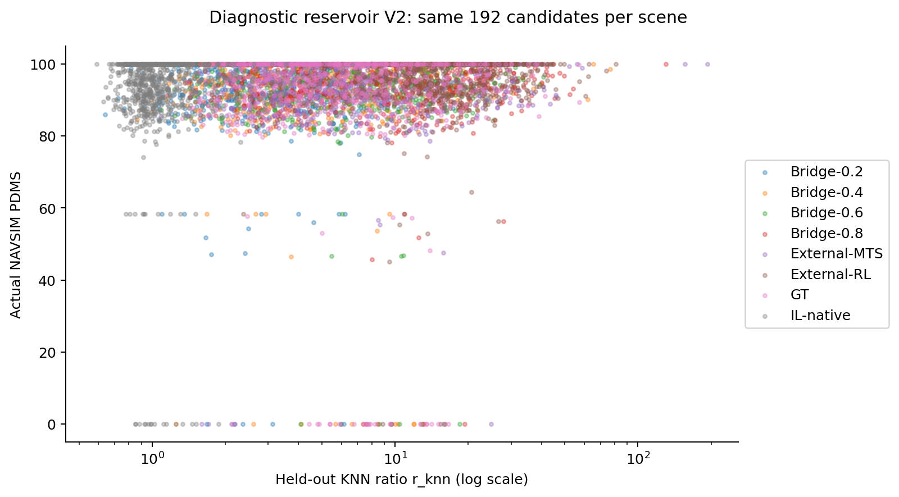

Fig-V2-1：统一 raw reservoir；仅散点显示采用固定种子子采样，统计使用全量。

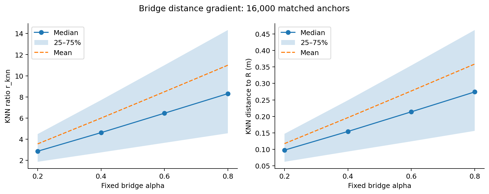

Fig-V2-2：固定 bridge alpha 的连续距离梯度。

16,000 anchor 组中，**99.96875%** 的 r_knn 随 alpha 严格递增；alpha0.8 大于0.2的比例为 99.98750%。平均 r_knn 依次为 3.563 / 5.998 / 8.489 / 11.004。5组非严格单调属于近邻集合变化下的少量例外；全部 bridge 的端点和 FP32 插值关系已逐条核验。未调整 alpha。

reservoir 提供了 Core/Boundary/Far，但大多数 bridge 在 alpha0.2 已超出 IL 的常见距离。原生 IL 是主要 Core/Boundary 来源，不能宣称 bridge 均匀填满了整个概率支持。

## Section E — Four candidate pools

* **Score**：全部有效 raw 候选严格按 PDMS descending top16；并列按固定原始 index。
* **Pareto**：复用历史 progress、TTC、driving-direction 的非支配排序，逐 front 补到16；同 front 按 PDMS，近似同分时优先多样性。复用 V1 的同分容差 0.01 PDMS point。
* **GT-distance**：使用上述 Pareto 顺序和 V1 已固定的 command-specific IL→GT 80/90/95% 距离阈值；完全没有重新校准。阈值按 left/right/straight 分别为 [0.50684,0.69741,0.98901] / [0.54105,0.76846,0.96483] / [0.56406,0.76672,0.98476] m。极端不足时按 Pareto front、d_GT、PDMS 补足；本次1000场景均在80%阈值层取得16条。
* **PC-MTS V2**：conservative feasible，Front≤2，PDMS≥固定场景 IL reference−1 point，50≤q_holdout<95，selection-local feasible≥0.75。q 只负责 eligibility。PDMS优先、0.02 m ADE 贪心去冗余。选择检查用 0.03/0.06 m 的独立轻扰动，与强 held-out probes 分离。

保守可行定义为 NC=DAC=TTC=DDC=1；hard failure 为 NC<1 或 DAC<1。固定 IL reference 复用 V1 的场景 reference rollout，未使用 APR 结果决定基准。

PC不足16时依序：Boundary local门槛0.75→0.50；保持质量条件的 Core（q由大到小，然后PDMS）；≤0.01m accepted-parent平滑形变并重新评分/检查兼容性；最后才 exact duplicate。**这些后两级是用户指定的补齐例外，不是192条原始 reservoir 中额外挖出的独立候选**。每条保存 raw_index、fallback level、parent、is_fill、qualified、ood_filler。

没有任何质量合格父轨迹时，使用评测前已声明的扩展：保留q<95，放宽质量要求选父轨迹，并标记unqualified；若连compatible候选都没有，才使用最近IL-native并标记OOD。后者本次未触发。Primary规则和扩展回退不能混为一个严格成功的 PC-MTS 结果。

| gate | mean_candidates | zero_scenes | at_least16_scenes |
| --- | --- | --- | --- |
| boundary | 20.2020 | 0 | 680 |
| boundary_feasible | 19.0530 | 38 | 630 |
| boundary_feasible_quality | 18.8030 | 38 | 611 |
| boundary_feasible_front | 7.1410 | 596 | 228 |
| boundary_feasible_front_quality | 7.1410 | 596 | 228 |
| primary | 7.1160 | 597 | 227 |
| core_all_quality | 5.5800 | 626 | 183 |

所有1000场景都有 Boundary 候选，但加上 Front≤2 后596场景没有 feasible Boundary；local门槛使其变为597。最终加入Core后仍有 **588** 场景无合格父轨迹。主要瓶颈仍是与整个raw bank比较的 Pareto front 约束，单纯扩大 IL 校准样本并没有解决它。本次未根据此结果更改 front/q/local 阈值。

PC严格合格场景412；原始选入候选总数6375，补齐9625/16000=60.16%，其中绝大多数为 tiny fill。全部 PC 候选均 q<95，OOD filler=0。报告同时保存全16、去fill、严格合格共同场景、同父候选数量的比较。

## Section F — Full-1000 results

各方法1000场景×16槽位；PDMS为0–100 points；距离为m；pool diversity为pairwise ADE。

| method | pdms | d_GT | r_knn | maha_ratio | maha_percentile | pool_diversity |
| --- | --- | --- | --- | --- | --- | --- |
| gt_distance | 95.8575 | 0.3287 | 8.4223 | 7.4626 | 90.0970 | 0.2477 |
| pareto | 97.1230 | 0.7640 | 17.1553 | 13.3618 | 96.4107 | 0.3704 |
| pc_mts | 94.2901 | 0.4105 | 1.2862 | 1.2212 | 72.5590 | 0.0597 |
| score | 97.3996 | 0.6021 | 15.9468 | 11.0185 | 97.2301 | 0.1738 |

| method | core | boundary | far | HQ_boundary | HQ_far |
| --- | --- | --- | --- | --- | --- |
| gt_distance | 9.0062 | 11.3937 | 79.6000 | 6.0812 | 61.9687 |
| pareto | 2.7437 | 5.4313 | 91.8250 | 5.3250 | 91.1437 |
| pc_mts | 4.9125 | 95.0875 | 0.0000 | 48.2375 | 0.0000 |
| score | 2.6250 | 4.3312 | 93.0438 | 4.3312 | 93.0438 |

上表区域列均为百分比。HQ Boundary/Far 还要求 PDMS≥该场景 raw p75。它们描述筛选结果；PC根据q筛选，所以这些比例**不是独立有效性证据**。

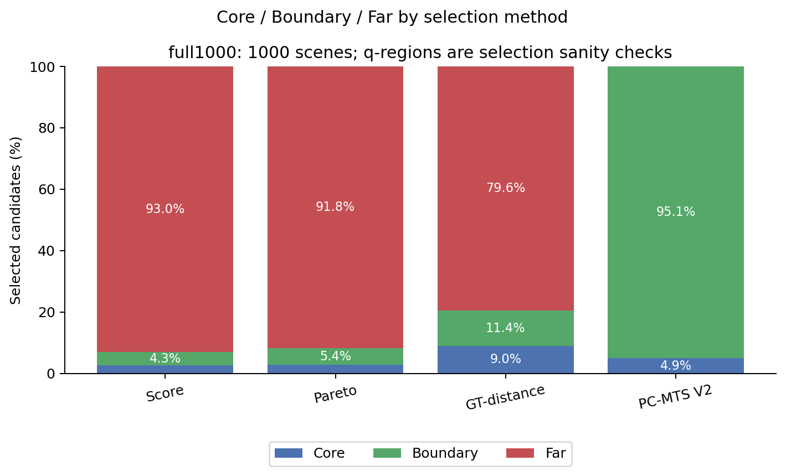

Fig-V2-3：Full-1000 四池区域比例。

PC的池内分散程度仅0.05968m，与大量补齐及选择IL局部支持有关。Score的source entropy更低、池内ADE为0.17380m；Pareto池最宽0.37036m。GT-distance的d_GT更低，但其79.60%候选仍在IL的Far区；“靠近GT”等于“靠近policy Core”不成立。

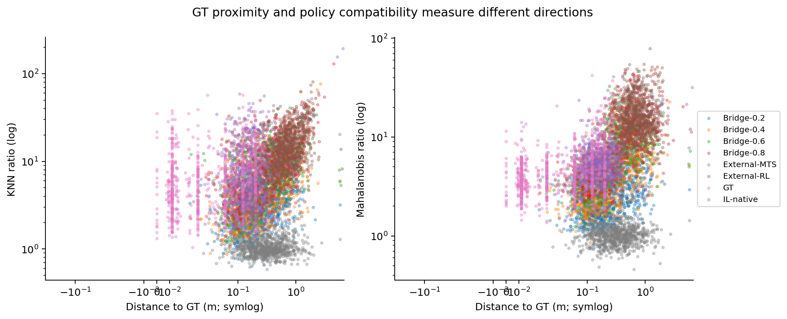

Fig-V2-5：GT距离与policy距离不同；坐标尺度在图中注明。

raw候选中 d_GT 与 r_knn 的 pooled Spearman=0.266，逐场景相关均值0.299；与Mahalanobis ratio分别为0.348、0.409。GT轨迹本身到GT距离为0，也仍可能远离当前IL随机支持。

## Section G — Contrastive stress-test subset

预先固定的 raw-only 条件：Core≥16、Far≥16、Boundary≥8；Core和Far均至少存在一条PDMS≥raw scene p75的候选。near明确指q<50。未使用四池表现筛选场景。得到 **276/1000** 场景，token清单保存在 [contrastive_scenes.json](../outputs/pc_mts_diagnostics_v2/manifests/contrastive_scenes.json)。

| method | pdms | d_GT | r_knn | maha_ratio | maha_percentile | pool_diversity |
| --- | --- | --- | --- | --- | --- | --- |
| gt_distance | 98.1680 | 0.2989 | 7.0137 | 6.9471 | 89.5996 | 0.3042 |
| pareto | 98.1792 | 0.4906 | 8.4459 | 8.8114 | 92.0060 | 0.4280 |
| pc_mts | 98.4797 | 0.3655 | 1.2489 | 1.2465 | 70.9623 | 0.1182 |
| score | 98.4912 | 0.1973 | 5.8588 | 4.4630 | 93.5796 | 0.0926 |

| method | core | boundary | far | HQ_boundary | HQ_far |
| --- | --- | --- | --- | --- | --- |
| gt_distance | 9.6694 | 13.0435 | 77.2871 | 12.2962 | 73.6413 |
| pareto | 7.0879 | 10.4846 | 82.4275 | 10.3034 | 81.9520 |
| pc_mts | 10.5525 | 89.4475 | 0.0000 | 88.3152 | 0.0000 |
| score | 6.6350 | 9.6920 | 83.6730 | 9.6920 | 83.6730 |

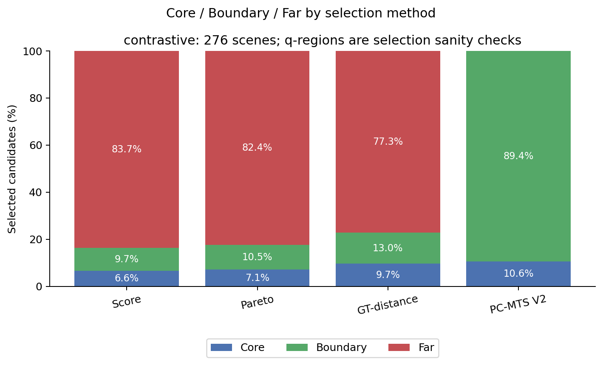

Fig-V2-4：276个预定义contrastive场景。

PC与Score的PDMS差为−0.0115 point，paired-scene bootstrap 95% CI=[−0.0520,0.0308]；相对于Pareto/GT-distance约+0.301/+0.312。这个子集刻意要求near也有高分，**不是全量的随机代表**；202/276场景的raw p75已经达到100（全量419/1000），高分并列和上限效应显著。因此不能用子集接近Score的结果掩盖Full-1000约−3.11 points的差距。

两组一致：PC更接近IL、更易由IL去噪恢复、局部Robust Radius更低。两组不一致：PDMS差距和池内多样性排序的幅度；必须并排解读。

## Section H — Held-out denoising reachability

固定500场景来自与结果无关的token哈希顺序，其中132属于contrastive。使用冻结official IL DiT，native schedule=[80,60,40,20,0]；最接近请求20%/50%/80%的有效步为t=20/40/80。50%目标49.5更接近40，因此没有发明schedule中不存在的t=50。

对候选先用native norm_odo归一化，再按native alpha/sigma做标准高斯forward noise；每level两个独立noise；调用原生p_mean_variance，以确定性DDIM eta=0从相应步反推到0，并保持native clipping、denorm。手动reverse与原get_action在完整确定性链上的结果一致。E_rec是六次XY ADE均值；epsilon按**该场景Q128×6误差的95%分位数**独立校准，未根据候选结果调节。

Q平均E_rec=0.193143m；epsilon跨场景平均=0.419013m。Return rate是六次误差中小于epsilon的比例，不代表真实采样时生成该候选的概率。

| method | E_rec_500_m | return_rate_500 |
| --- | --- | --- |
| gt_distance | 0.4403 | 0.5557 |
| pareto | 0.7355 | 0.3129 |
| pc_mts | 0.2223 | 0.9139 |
| score | 0.7051 | 0.3648 |

| method | E_rec_132_m | return_rate_132 |
| --- | --- | --- |
| gt_distance | 0.3731 | 0.6680 |
| pareto | 0.4415 | 0.5642 |
| pc_mts | 0.2108 | 0.9321 |
| score | 0.3744 | 0.6869 |

Full500 PC−Score E_rec=−0.48280m，95% CI=[−0.53025,−0.43836]；return rate差+0.54915，[0.51614,0.58161]。contrastive132也同向。候选r_knn与E_rec的pooled相关0.879、逐场景相关均值0.844，支持连续距离具有模型恢复意义。

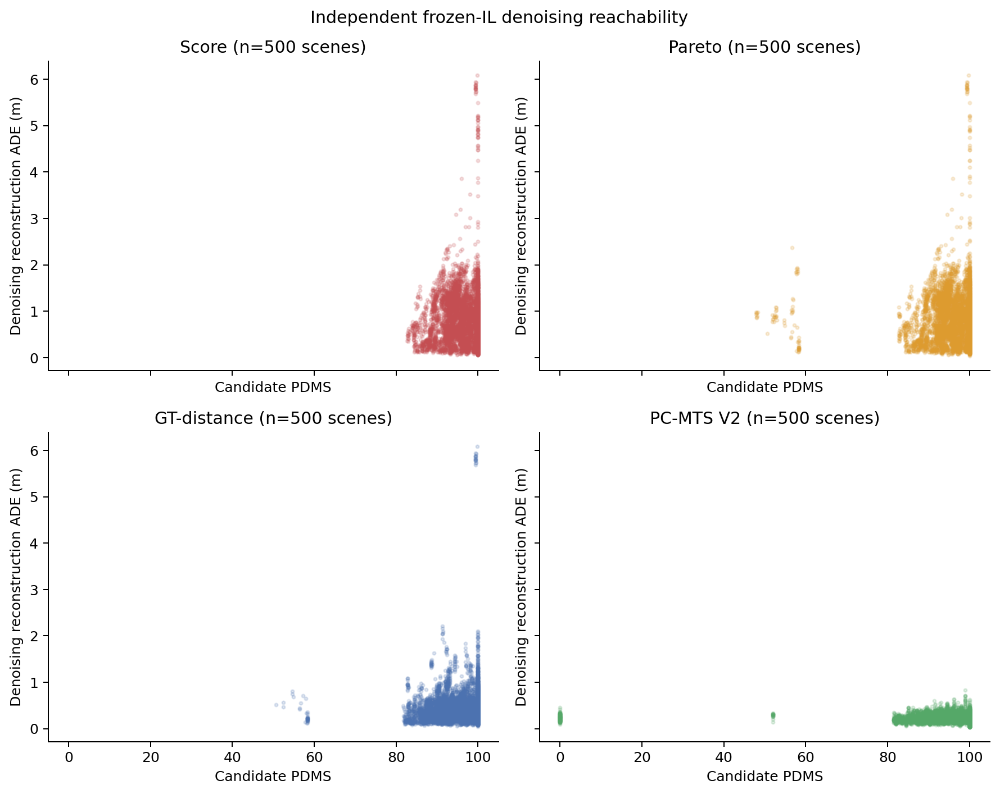

Fig-V2-6：候选PDMS与独立去噪误差。

**来源控制限制**：同一IL-native来源、同场景对比PC与Score的62个去噪场景，PC E_rec反而高0.00938m，95% CI约[0.00005,0.01880]；return rate差−0.01310，[−0.03029,0.00406]。Bridge-0.2的共同去噪场景仅6个，区间不确定。总体恢复优势很大程度来自PC选择更多IL-native，不能宣称PC在任意相同来源内部都更优。Mahalanobis还与KNN共享R/Q，属于替代几何度量；DiT去噪是更独立的模型验证。

本实验没有进行候选池→新模型训练，不能把这些指标称为已证实的 downstream training gain。来源条件分析是对选择混杂的检查。

## Section I — Stronger local robustness

全量64,000候选×24 held-out形变=1,536,000次真实NAVSIM评分。每幅度0.05/0.15/0.30/0.50m，3family×2方向：平滑lateral；随时间增大的曲率旋转；沿trajectory heading的longitudinal/progress形变。幅度定义为最大XY位移，方向和时间结构连续；不是每个点独立添加噪声。heading按平移前后切线变化更新，并对近静止段作固定速度门控。

实现检查发现初次版本向这三个family传入seed，但没有消耗seed改变形状。该缺陷已修复：幅度归一化前乘低频包络`1+0.1*z*sin(pi*u)`，z来自对应probe的独立Uniform(-1,1)随机数；相同seed严格复现，不同seed改变平滑形状，最终最大幅度仍严格保持四档指定值。这一规则在重新评分前写入 `manifests/seeded_robustness_correction.json`，未搜索系数。全部1,536,000次强扰动重新评分，primary采用 `heldout_seeded`；原确定性缓存、初稿和表格完整保存在V2审计目录。候选选择及去噪结果不依赖此修正。

| method | robust_radius_seeded_primary | local_feasible_seeded_primary | robust_radius_initial_deterministic | local_feasible_initial_deterministic |
| --- | --- | --- | --- | --- |
| gt_distance | 0.4145 | 0.9405 | 0.4146 | 0.9405 |
| pareto | 0.4312 | 0.9423 | 0.4314 | 0.9424 |
| pc_mts | 0.3891 | 0.9169 | 0.3893 | 0.9169 |
| score | 0.4224 | 0.9381 | 0.4225 | 0.9381 |

Robust Radius是最大的通过幅度，要求该幅度及所有更小幅度的6探针feasible≥2/3、mean PDMS drop≤2points；0.05m不通过则0。CVaR20取24探针中最差ceil(24×0.2)=5个分数均值。Robustness AUC是signed drop/100随幅度积分（含0点），再除0.5；越低越好。Worst-direction Drop按用户定义取三个family中最差的跨幅度/正负方向平均drop。

| method | local_mean | local_P10 | local_CVaR20 | local_feasible | hard_failure | robust_radius | robustness_AUC | worst_direction_drop |
| --- | --- | --- | --- | --- | --- | --- | --- | --- |
| gt_distance | 92.9499 | 85.7626 | 82.8939 | 0.9405 | 0.0278 | 0.4145 | 0.0285 | 4.6373 |
| pareto | 95.0998 | 90.0374 | 88.1212 | 0.9423 | 0.0185 | 0.4312 | 0.0197 | 3.2589 |
| pc_mts | 90.6636 | 81.4973 | 78.1949 | 0.9169 | 0.0440 | 0.3891 | 0.0358 | 5.8466 |
| score | 94.9419 | 89.0033 | 86.8080 | 0.9381 | 0.0218 | 0.4224 | 0.0240 | 3.8993 |

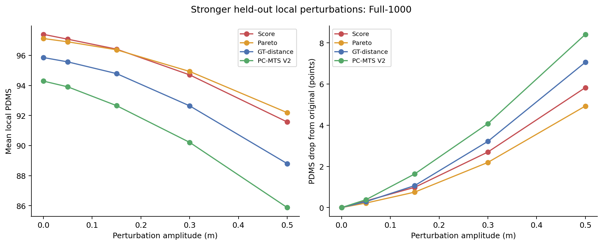

Fig-V2-7：Full-1000扰动曲线，包括绝对PDMS和相对原始轨迹的drop。

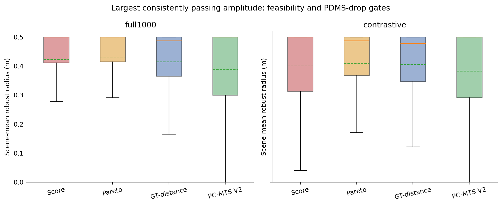

Fig-V2-8：四方法的逐场景平均Robust Radius分布。

Full-1000 PC−Score radius=-0.03332m，95% CI=[-0.04072,-0.02590]；contrastive为-0.01722m，[-0.02543,-0.00936]。Local Feasible差分别为-2.13和-0.94个百分点。**本结果不支持“Score高分轨迹的robust basin比PC更窄”。**

仅比较共同的412个严格合格场景，PC radius=0.40523m、Score=0.41714m，方向仍未逆转。匹配每场景PC的raw parent数量，并令其他方法取相同数量的前缀后，PC−Score radius仍为-0.03075m；因此并非简单的16槽位重复计数才出现局部弱势。

注意：补齐会把优质父轨迹重复计入池均值，导致严格合格子集PC的16槽位平均PDMS略高于Score top16。这不违反Score规则，因为前者含新增tiny/duplicate。等raw候选数量比较时，Score PDMS逐场景均不低于PC，已加入断言验证。相关控制表全部随结果发布。

## Section J — Policy distribution stratification

主分析始终使用每个checkpoint每场景**64条**，共320,000条V1真实rollouts。Spread-AUC是8个时间点XY样本标准差范数的平均；SR逐场景除以同场景IL的Spread-AUC，不能把“平均SR”与“全局均值之比”混用。

| IL_spread_quartile | checkpoint | median_SR | strongly_compressed | hit8_delta_IL | D_positive |
| --- | --- | --- | --- | --- | --- |
| Q1 | mts_8692 | 0.5199 | 0.4720 | -0.0840 | 0.0904 |
| Q1 | mts_8751 | 0.4968 | 0.5080 | -0.0545 | 0.1605 |
| Q2 | mts_8692 | 0.4695 | 0.5360 | -0.0605 | 0.0823 |
| Q2 | mts_8751 | 0.4439 | 0.6080 | 0.0100 | 0.2647 |
| Q3 | mts_8692 | 0.4295 | 0.6320 | -0.0415 | 0.0959 |
| Q3 | mts_8751 | 0.4013 | 0.7480 | 0.0080 | 0.2394 |
| Q4 | mts_8692 | 0.3751 | 0.6800 | -0.0735 | 0.0979 |
| Q4 | mts_8751 | 0.3736 | 0.7880 | -0.0170 | 0.0959 |

Q1→Q4由official IL本身Spread-AUC定义，每档250场景。MTS86 median SR从0.520降至0.375，MTS87从0.497降至0.374；Q4中SR<0.5比例分别68.0%和78.8%。压缩在原本spread较大的场景更显著，仍不能仅凭高spread把场景断言为“多模态”。

驾驶结构方面：MTS87在left和高GT heading variation下median SR较低；但Hit@8下降最明显的是straight和低heading-change场景。两个MTS在低heading-change组Hit@8相对IL分别下降约15.32和12.09个百分点，high组却没有对应下降。**压缩强度和探索质量损失并非同一个分层模式。** 分command、heading低/中/高的完整结果均已保存。

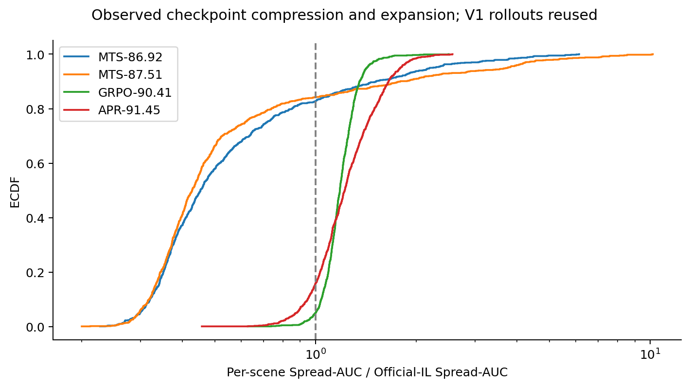

Fig-V2-9：每场景Spread Ratio ECDF。

MTS86 / MTS87有82.7% / 84.2%场景SR<1，58.0% / 66.3%场景SR<0.5。100次共同索引的16/32/64无放回子采样中，两个MTS更窄、GRPO/APR更宽的全局排序均未翻转。子采样区间只度量已有64条内的选择敏感性，不能代替总体置信区间；另提供3000次paired-scene bootstrap。

| model | metric | n_rollouts | delta_to_IL | CI95_low | CI95_high |
| --- | --- | --- | --- | --- | --- |
| mts_8692 | pairwise_ade | 64 | -0.0607 | -0.0656 | -0.0552 |
| mts_8751 | pairwise_ade | 64 | -0.0613 | -0.0668 | -0.0553 |
| grpo_9041 | pairwise_ade | 64 | 0.0257 | 0.0246 | 0.0267 |
| apr_9145 | pairwise_ade | 64 | 0.0383 | 0.0359 | 0.0407 |
| mts_8692 | hit8_1 | 64 | -0.0649 | -0.0882 | -0.0415 |
| mts_8751 | hit8_1 | 64 | -0.0134 | -0.0391 | 0.0121 |
| grpo_9041 | hit8_1 | 64 | 0.1869 | 0.1576 | 0.2175 |
| apr_9145 | hit8_1 | 64 | 0.1954 | 0.1631 | 0.2278 |

MTS86的Hit@8下降有明确paired CI支持；MTS87的全量Hit@8差−0.01338，其CI跨0，不能宣称两个MTS的Hit都显著下降。D_positive仅在至少两条feasible且PDMS>reference的场景定义；有效场景数IL/MTS86/MTS87/GRPO/APR=623/380/458/566/543，条件均值不可当作相同场景覆盖的总体均值。

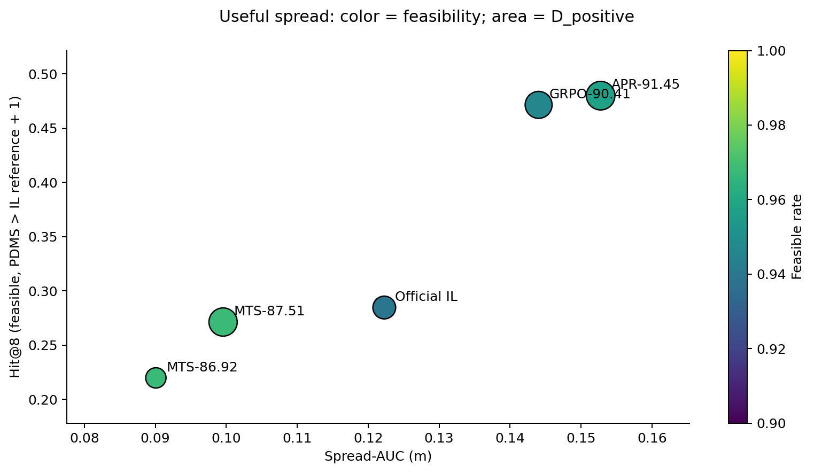

Fig-V2-10：spread与高质量命中；点颜色为feasibility，面积为D_positive。

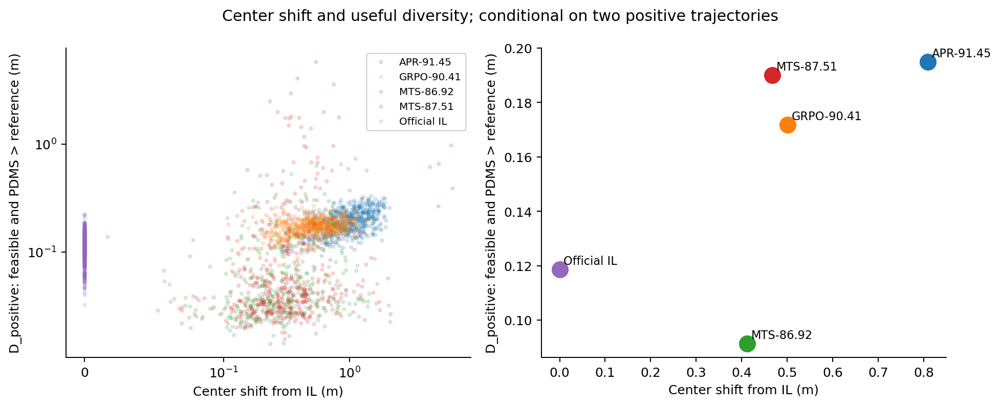

Fig-V2-11：center shift与useful diversity。

GRPO/APR的Hit@8为0.4715/0.4800，相对IL0.2846显著提升，同时D_positive为0.1717/0.1949m。说明其额外spread有一部分对应更高质量可行探索；不说明“越宽越好”，也不说明所有扩张方向都安全。五checkpoint不同训练起点、adapter和FS normalization仍是因果解释混杂。

## Section K — Matched historical GRPO chains

搜索覆盖outputs、container backup、旧worktrees、docs、reports。检查25871份metadata/report文件，关键词含85.8、86.7、90.3、score_mts、pareto_mts、gt_distance、stage3、grpo；匹配保留路径、SHA256和行号。大于8MB的3份metadata文件未做全文扫描；没有用相近分数或名称猜测链。

找到3条有训练Hydra配置、初始checkpoint/reference checkpoint一致性和实存快照的链。固定300场景×32条common-random-number rollouts；step0直接复用V1各起点的前32条。**这是单独的纵向链实验；五模型分布主实验仍为每场景64条。** 每条取step0、最早保留快照、中间、最后保留快照，未按新评测分数挑checkpoint。

| chain | algorithm | step | role | spread_auc | spread_ratio_step0 | mean_pdms | feasible_rate | D_positive | hit8_1 |
| --- | --- | --- | --- | --- | --- | --- | --- | --- | --- |
| mts86_lfp_grpo | lfp_grpo | 0 | step0 | 0.0910 | 1.0000 | 94.3080 | 0.9746 | 0.0952 | 0.2200 |
| mts86_lfp_grpo | lfp_grpo | 300 | early | 0.2014 | 3.3072 | 95.1557 | 0.9600 | 0.2451 | 0.4933 |
| mts86_lfp_grpo | lfp_grpo | 1800 | middle | 0.1901 | 3.3192 | 95.7987 | 0.9452 | 0.1928 | 0.5967 |
| mts86_lfp_grpo | lfp_grpo | 3300 | final_available | 0.1844 | 3.1840 | 96.1195 | 0.9483 | 0.1890 | 0.6000 |
| mts87_lfp_grpo | lfp_grpo | 0 | step0 | 0.0944 | 1.0000 | 94.8041 | 0.9770 | 0.1489 | 0.2808 |
| mts87_lfp_grpo | lfp_grpo | 300 | early | 0.4656 | 8.6062 | 96.6969 | 0.9424 | 0.5899 | 0.6200 |
| mts87_lfp_grpo | lfp_grpo | 4200 | middle | 0.3026 | 5.7363 | 98.7458 | 0.9715 | 0.3817 | 0.6358 |
| mts87_lfp_grpo | lfp_grpo | 8100 | final_available | 0.2786 | 5.2978 | 98.9144 | 0.9721 | 0.3459 | 0.6342 |
| official_il_grpo | original_GRPO | 0 | step0 | 0.1236 | 1.0000 | 92.2523 | 0.9442 | 0.1210 | 0.2842 |
| official_il_grpo | original_GRPO | 1330 | early | 0.2697 | 2.2230 | 91.9262 | 0.9130 | 0.3046 | 0.4983 |
| official_il_grpo | original_GRPO | 6650 | middle | 0.1791 | 1.4669 | 94.4229 | 0.9480 | 0.2134 | 0.4400 |
| official_il_grpo | original_GRPO | 13300 | final_available | 0.1421 | 1.1644 | 95.0144 | 0.9653 | 0.1667 | 0.4100 |

官方IL→原版GRPO：0/1330/6650/13300；末端是epoch9，V1选定90.41权重为epoch8，两者不是同一个文件。早期spread明显扩张但平均PDMS略降，之后spread收窄并保留高于起点的宽度，质量提升。这直接反驳单调“越宽越好”。

MTS86→LFP-GRPO：0/300/1800/3300；MTS87→LFP-GRPO：0/300/4200/8100。最后保留快照相对起点在本Navtrain300 cohort的PDMS分别+1.8115/+4.1103 points，Hit@8分别+0.3800/+0.3533。二者存在显著的训练后扩张，不能据此证明压缩必然阻碍后续RL。LFP-GRPO与原版GRPO不是同一算法；最后保留step不保证已完成计划的全部训练。所有结果来自训练分布场景，不是独立Navtest增益证明。

**Score-MTS→GRPO degradation、Pareto-MTS→GRPO degradation、GT-distance-MTS→GRPO limited gain：matched causal chain unavailable。** 两个MTS起点的有效target来自offline DPSI support archives，不能因文件名含Pareto或GT-distance，就将它们映射成V2的M1/M2/M3。可核验链和所缺配方映射在 [historical_chains.json](../outputs/pc_mts_diagnostics_v2/manifests/historical_chains.json) 中区分记录。

附图S2为完整链演化；S3为初始SR与随后matched gain的散点。它们提供观测关系，不估计随机分配条件下的训练因果效应。

## Section L — Revised mechanism and answers

| 问题 | 本次证据支持的回答 |
| --- | --- |
| Q1 为什么V1全被判OOD？ | 校准self距离薄，候选中心偏移，CDF尾部截断；并非仅靠增加样本就能抹平真实距离。 |
| Q2 四种规则实际选什么？ | Score/Pareto大量选Far高分；GT-distance偏向更近GT但仍以Far为主；PC以IL-native Boundary及父轨迹补齐为主。 |
| Q3 GT距离与policy距离不同吗？ | 不同，相关有限；GT距离0不保证处于IL Core。 |
| Q4 compatible候选更可由DiT恢复吗？ | 总体支持；同来源控制后PC的特殊优势没有得到普遍支持。 |
| Q5 Score的robust basin更窄吗？ | 本次不支持；PC在全量、contrastive和严格合格共同场景上Robust Radius均更低。 |
| Q6 GT-distance选安全但冗余的Core吗？ | 只支持更近GT；全量79.6%仍为Far，池内ADE也高于Score，不能称为Core冗余机制。 |
| Q7 PC选择可达但低概率的高质量Boundary吗？ | 选择了距离定义的Boundary，去噪恢复较好；仅412场景有严格合格父轨迹，不能将q等同生成概率。 |
| Q8 MTS为什么更窄？ | 真实压缩且高IL-spread场景更明显。target weighting、监督目标、FS normalization、架构及随机初始化均可能贡献，当前无法隔离单一原因。 |
| Q9 GRPO/APR为何更宽且Hit更高？ | 宽度、中心位移和正质量多样性共同变化；matched GRPO显示先大幅扩张再收敛，最终保留有用探索。绝对宽度不是质量的充分统计量。 |

应放弃或收缩：所有MTS都扩张policy；所有GRPO/APR都使policy更尖；q区域比例本身证明PC有效；高PDMS候选必然局部脆弱；GT-distance等同policy Core；PC能够在所有场景提供16条独立合格Boundary；MTS87的Hit@8显著低于IL；仅凭五checkpoint即可推断历史MTS→GRPO退化。

得到支持的新假说：这些MTS checkpoint发生条件随机支持压缩；压缩对高IL-spread场景更强；GT proximity与IL compatibility区分不同几何；连续KNN距离与模型恢复误差有关；兼容性和局部安全鲁棒性是不同轴；GRPO可先扩张再收敛，而Useful Spread比单独宽度更有解释价值。有关“多轨迹SFT导致压缩”的机制解释仍需控制架构/初始化/目标配方的训练实验验证。

### 复现、完整性与交付

代码：[tools/analysis/pc_mts_diagnostics_v2](../tools/analysis/pc_mts_diagnostics_v2/README.md)。固定配置：[analysis.yaml](../configs/pc_mts_diagnostics_v2/analysis.yaml)。全部新缓存：[outputs/pc_mts_diagnostics_v2](../outputs/pc_mts_diagnostics_v2/)。11张核心图PNG/PDF及补充图保存在 `figures/`；原始表、按来源匹配、去fill、同候选数、paired CI、全部strata和历史链表在 `metrics/`。

GPU推理使用torchrun 8进程，每GPU4个DataLoader worker；CPU evaluator96进程，OMP/MKL/OpenBLAS线程各1。FP32，保留native sampler。NAVSIM批量与标量评分parity通过；完整1000场景逐条核验尺寸、来源、bridge插值、KNN/Mahalanobis重算、Score top16、严格PC gates、held-out最大位移和Q-calibrated epsilon。只停止已有GPU pressure jobs以运行任务，GPU工作结束后已恢复8个原任务。

V1保护清单在 `manifests/V1_IMMUTABLE_FILES.json`。最终复核：29,122个文件完整SHA256不变；8个旧GPU压测日志在原进程停止前各自动追加了162字节状态行，原始字节前缀SHA256全部一致。运行日志追加作为例外明确记录在 `V1_RUNTIME_LOG_APPEND_AUDIT.json`，没有为恢复哈希而截断或覆盖日志；恢复后的压测任务仅向V2写日志。V1科学结果、CSV、checkpoint、实现和报告均未改写。主实验没有删除场景；没有调整alpha、contrastive定义或q阈值去追求PC获胜；完整1000及不支持假说的结果均保留。
