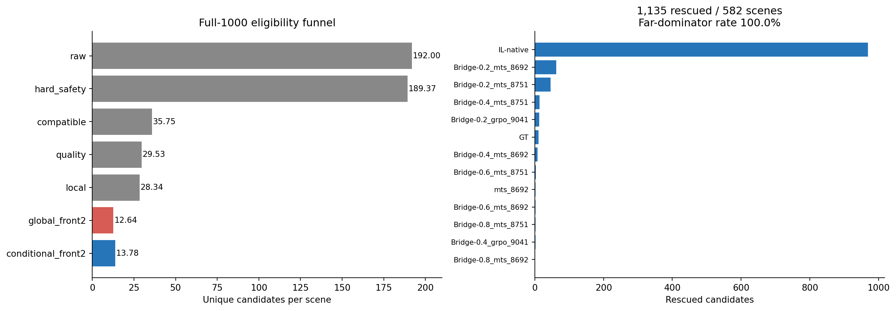
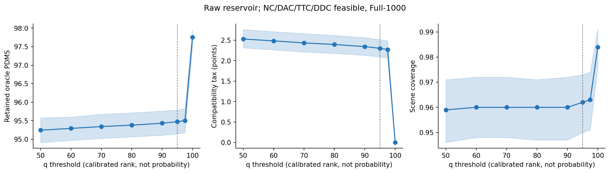
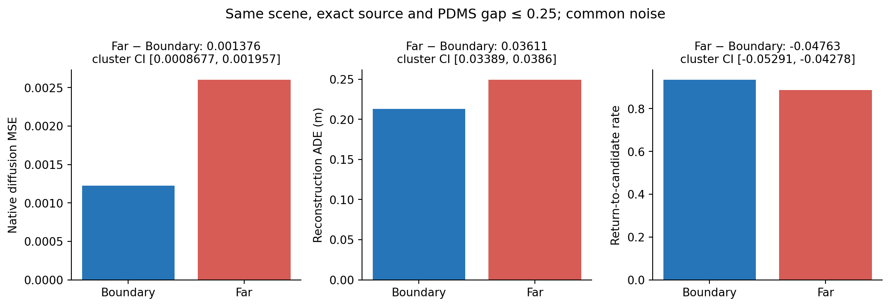
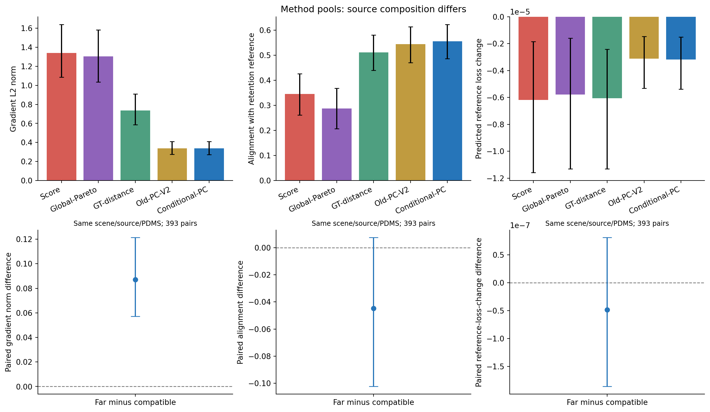
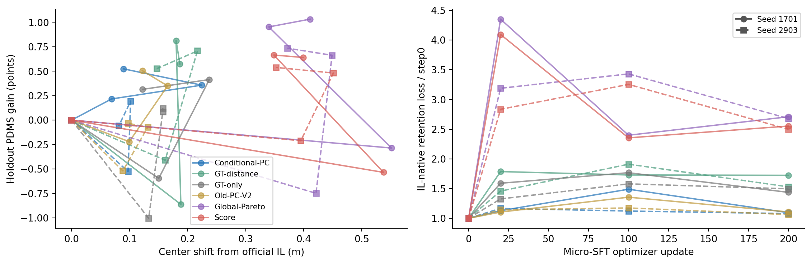
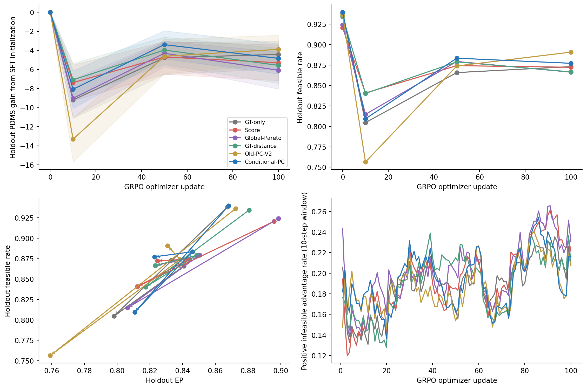
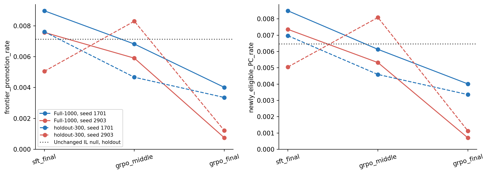

# PC-MTS V3：机制与受控因果诊断

本报告保留支持和失败结果。V1/V2 未被替换。V3 的 192-candidate reservoir 是分析专用的 controlled diagnostic space，**不是历史训练数据**。本轮完成 A–G、两 seed Micro-SFT、两 seed 短程 original-GRPO 和 progressive-support 分析；不把静态兼容性关联直接写成下游优化的因果保证。

分支：`analysis/pc-mts-policy-diagnostics-v3-20260913`；base commit：`f499be15d693a6910593ec2c8f081c249cdbf871`。主配置 SHA256：`e0decb6e64854f06f29ce81af3031c74149eb6d1b9041f2b0a1bd79cf85cceaf`。全部相对输出路径以 `outputs/pc_mts_diagnostics_v3/` 为根。

V1/V2原始观察保持不变：IL pairwise ADE约0.1448，MTS-86.92/87.51约0.0841/0.0835，GRPO/APR约0.1705/0.1831。这些历史checkpoint不是严格matched causal chain。V3通过相同初始化、相同训练预算与真实短程更新检验机制，而不是改写“Multi-SFT更窄、GRPO/APR更宽”的旧数据。

## 1. 预先固定的设计与数据边界

1000 个原始场景、每场景 192 条原始候选；split 在新训练前按 token hash 固定为 700 train / 300 diagnostic holdout。两个 seed 为 1701、2903。Micro-SFT 200 updates，保存 0/20/100/200；GRPO 100 updates，保存 0/10/50/100。每个快照在全部 300 holdout scenes 上生成相同的 64 条 CRN 随机 rollout。官方 IL step0 只生成一次并共享缓存；没有重复计算 V1 五 checkpoint 的 1000×64。

这里的PDMS是固定内部场景上的64-rollout平均，不能与历史checkpoint名称中的86.92、90.41或91.45直接作分数升降比较；那些名称保留历史权重身份，本轮分母与评测采样方式不同。

**不能称为完全无泄漏的独立测试集。** 新训练未使用 holdout token 更新权重，但 195/300 个 holdout scenes 与训练 scenes 共享 log（共 132 个重叠 logs）；历史 checkpoint 可能已在这些 Navtrain scenes 上训练。冻结的 V1 GT-distance 阈值也曾利用完整 1000 场景的 GT-distance 校准，包括后来划入 V3 holdout 的 300 场景。为保持 frozen baseline，没有重校准阈值。该实验是新更新之外的内部机制诊断，不是 untouched Navtest，也不支持 SOTA 或外部泛化结论。

核心差值采用至少 3000 次 scene-paired bootstrap；匹配候选同时报告 pair-level 和 scene-cluster bootstrap。固定效应回归使用 scene 与 exact-source FE，3000 次 wild scene-cluster bootstrap；不以 pooled correlation 为主要证据。训练结果先在每个 scene 内平均两个 seeds，再做 scene-paired inference，并单独公开每个 seed；两 seeds 不能充分估计训练随机性总体。另报告 log-cluster 敏感性。

表中的win_fraction/scene_win_fraction统一表示所注明差值大于0的比例；对于loss、interference或failure等指标，正差值并不等于更好。所有区间均为逐项95%区间，没有把大量指标中的偶然显著值当作统一成功判据。

## 2. PC-MTS-Conditional 的实际实现

顺序为 hard safety/validity → q<95 compatibility → PDMS quality floor → selection-local gate → compatible set 内重新计算 Pareto → Boundary 优先 → diversity tie-break。hard safety 只要求 NC=DAC=1；local gate 是四个已有 light probes 中 NC/DAC/TTC/DDC 全部满足的比例≥0.75。strict floor 为 PDMS≥reference；secondary 才允许 reference−1。q 为独立 Q→R 校准的 KNN 距离经验秩，不是概率或 likelihood。连续 d_CR、r_knn、maha_ratio 全部保留。

这里的behavioral support是有限rollout bank下的操作性诊断；Far表示几何校准分布的尾部，**不表示模型概率为0或严格不可达**。同理，原生epsilon MSE不是直接报告的trajectory likelihood。

Boundary 为 50≤q<95，先按 conditional front 再按 PDMS 与小于 0.01 point 的质量并列项中的多样性选择；Boundary 不足时用最靠近边界的 Core。Conditional primary 遍历所有 conditional fronts，不沿用 global Front≤2 的硬截断。仅改变 Front≤2 的计算位置的纯 gate-order 对照单独报告，不能把完整新 selector 的全部覆盖收益归因于 gate order。

分析池禁止 tiny/exact-duplicate 填充，只计 unique raw parents。Old-PC 的原 16-slot baseline 保持只读，主比较剔除其非 raw filler；原始 16-slot 与原算法资格统计另外保留。训练需要 16 slots 时，slot loss 权重为 `1/(U × multiplicity(parent))`，每个 unique parent 总权重等于 `1/U`。零 parent 场景显式使用 GT 训练 fallback，绝不计作 strict PC 成功。

## 3. Experiment A — Gate-order counterfactual

| method | strict_candidate_count | unique_candidate_count | zero_strict_scene | scene_has_4 | scene_has_8 | scene_has_16 | secondary_count | PDMS |
| --- | --- | --- | --- | --- | --- | --- | --- | --- |
| conditional_pc | 15.113 | 15.208 | 0.04 | 0.953 | 0.948 | 0.919 | 0.095 | 95.012 |
| gt_distance | 2.91 | 16 | 0.431 | 0.249 | 0.14 | 0.025 | 0 | 95.857 |
| old_pc | 6.303 | 6.375 | 0.043 | 0.361 | 0.356 | 0.336 | 0 | 94.345 |
| pareto | 1.248 | 16 | 0.568 | 0.067 | 0.04 | 0.004 | 0 | 97.123 |
| quality_only | 15.113 | 15.208 | 0.04 | 0.953 | 0.948 | 0.919 | 0.095 | 95.012 |
| score | 1.074 | 16 | 0.846 | 0.101 | 0.069 | 0.005 | 0 | 97.4 |

这里 strict_candidate_count 对所有方法统一指“已选 unique raw parents 中满足 V3 strict 条件的数量”；raw preselection availability 另列 strict_available_in_raw。Conditional 有 38/1000 场景没有可输出的 unique pool，40/1000 没有 strict candidate；这些场景没有从 Full-1000 coverage 统计中删除。候选 PDMS 对空池未定义，因此 Conditional 的 PDMS 均值基于 962 个非空池，不能直接与其他方法 1000 场景均值比较。

在相同的 962 个非空场景上，Conditional 相对各 baseline 的 PDMS 差值如下（这不是挑选获胜场景，而是对未定义的空池质量明确给出可比较分母；Full-1000 覆盖仍完整报告）：

| method | n | mean | median | ci_low | ci_high | win_fraction |
| --- | --- | --- | --- | --- | --- | --- |
| score | 962 | -2.371 | -1.1437 | -2.585 | -2.1539 | 0 |
| pareto | 962 | -2.1543 | -1.0768 | -2.4076 | -1.9134 | 0.017672 |
| gt_distance | 962 | -0.82587 | -0.076613 | -0.98654 | -0.66114 | 0.11746 |
| old_pc | 962 | -0.44514 | -0.27566 | -0.48144 | -0.4097 | 0.006237 |

共 **1135** 条 rescued candidates，涉及 **582/1000** 场景；far-dominator poisoning rate 为 **100.0%**。每条 rescued candidate 的完整 dominator set 保存于 `metrics/A_rescued_dominators.parquet`。它证明了全局 gate 的过滤行为，不单独证明被排除者一定能改善训练。

保持 V2 其他 eligibility 条件不变，只替换 Pareto rank 计算集合时，平均 Front≤2 可用数从 **12.65500** 变为 **13.79800**。完整 Conditional 还取消了只允许前两层的硬截断，并采用新的 hard safety/quality 规则，因此其 16-parent coverage 变化不是纯 gate-order 效应。

原 V2 的 zero-qualified-parent scenes 仍为 **588/1000**；不要与本表对其 fallback raw parent 使用统一 V3 条件复核后的零 strict 比例混淆。原始 V2 qualification 与 filler 数量在 `A_original_V2_qualification.csv`。

**Pareto degeneration：** strict compatible eligibility 内 TTC、DDC 都恒为 1。目标未被替换，但排名几乎只剩 EP。quality-ranking-only 消融与 Conditional 的平均 parent-set Jaccard 为 **0.996659**，完全相同的场景比例为 **97.4%**。因此本轮不支持多目标 Pareto 本身具有独立贡献。

## 4. Experiment B — Quality–Compatibility Frontier

直接遍历 raw reservoir；primary feasible 要求 NC/DAC/TTC/DDC 全为 1，另报告仅 NC/DAC 的 sensitivity。top-k 固定 k=4，不足4时不伪造 top4 均值。q阈值100包含全部候选，其余阈值使用严格小于。retained oracle quality 与 tax 在存在可行候选的场景上计算，coverage 则始终以全部1000场景为分母。

| q_threshold | n | mean | median | P25 | P50 | P75 | P90 | ci_low | ci_high |
| --- | --- | --- | --- | --- | --- | --- | --- | --- | --- |
| 50 | 959 | 2.5288 | 1.1659 | 0 | 1.1659 | 3.5533 | 7.4936 | 2.314 | 2.7621 |
| 60 | 960 | 2.4828 | 1.1267 | 0 | 1.1267 | 3.5221 | 7.4417 | 2.2642 | 2.7072 |
| 70 | 960 | 2.4337 | 1.0657 | 0 | 1.0657 | 3.4756 | 7.3094 | 2.2114 | 2.6605 |
| 80 | 960 | 2.3949 | 1.0018 | 0 | 1.0018 | 3.4656 | 7.3094 | 2.1779 | 2.6164 |
| 90 | 960 | 2.3437 | 0.8603 | 0 | 0.8603 | 3.3674 | 7.155 | 2.1306 | 2.5641 |
| 95 | 962 | 2.3011 | 0.82159 | 0 | 0.82159 | 3.2655 | 6.9751 | 2.0919 | 2.5113 |
| 97.5 | 963 | 2.2718 | 0.73633 | 0 | 0.73633 | 3.2642 | 6.9177 | 2.064 | 2.4859 |
| 100 | 984 | 0 | 0 | 0 | 0 | 0 | 0 | 0 | 0 |

| metric | n | mean | median | ci_low | ci_high |
| --- | --- | --- | --- | --- | --- |
| fraction_within_oracle_0.25 | 1000 | 0.42 | 0 | 0.39 | 0.45003 |
| fraction_within_oracle_0.5 | 1000 | 0.445 | 0 | 0.414 | 0.476 |
| fraction_within_oracle_1.0 | 1000 | 0.498 | 0 | 0.466 | 0.529 |
| boundary_headroom | 959 | 0.20734 | 0.02829 | 0.18301 | 0.23223 |
| boundary_headroom_positive_full1000 | 1000 | 0.503 | 1 | 0.472 | 0.53403 |
| boundary_gain_over_reference | 962 | 1.9647 | 0.60952 | 1.3997 | 2.6386 |
| boundary_gain_over_reference_positive_full1000 | 1000 | 0.623 | 1 | 0.595 | 0.653 |

结果支持存在有限的 Boundary headroom，但不能把“兼容性约束几乎没有质量代价”当作前提。Full-1000 的 oracle 接近比例、空集合和 coverage 全部公开，没有事后定义成功场景。

## 5. Experiment C — Source/quality-matched learnability

primary 匹配 PDMS gap≤0.25 point：3274 对、890 scenes，其中3209对为Boundary-vs-Far，65对为Core-vs-Far。另有0.5 point sensitivity，未替换primary。匹配固定same scene、exact source、NC/DAC class，Boundary优先，最大匹配数下最小总PDMS gap，一对一无replacement。每对使用完全相同的原生timestep与epsilon。官方原生参数化是epsilon，采用原归一化与uniform integer t∈[0,99]；不虚构native x0预测头。

| metric | n | near_mean | far_mean | mean | median | cluster_ci_low | cluster_ci_high | scene_win_fraction |
| --- | --- | --- | --- | --- | --- | --- | --- | --- |
| diffusion_loss | 3274 | 0.0012201 | 0.0025757 | 0.0013556 | 5.4721e-05 | 0.00085797 | 0.0019252 | 0.80899 |
| loss_t20 | 3274 | 0.00035086 | 0.0008792 | 0.00052835 | 7.432e-05 | 0.00035536 | 0.00072666 | 0.8618 |
| loss_t50 | 3274 | 6.6823e-05 | 0.00012813 | 6.1307e-05 | 8.1617e-06 | 4.1936e-05 | 8.3576e-05 | 0.80562 |
| loss_t80 | 3274 | 2.5506e-05 | 3.1716e-05 | 6.2102e-06 | 8.1786e-07 | 4.2904e-06 | 8.3836e-06 | 0.74607 |
| E_rec | 3274 | 0.21277 | 0.24926 | 0.036483 | 0.023352 | 0.034258 | 0.038859 | 0.89326 |
| return_rate | 3274 | 0.93479 | 0.88648 | -0.04831 | 0 | -0.053389 | -0.043227 | 0.057303 |

下表回归只使用每场景预先hash抽取的8条raw candidates，共8000条；同时控制r_knn、PDMS、d_GT、scene FE和exact-source FE：

| outcome | coefficient | ci_low | ci_high | n | scenes | sources |
| --- | --- | --- | --- | --- | --- | --- |
| diffusion_loss | 0.0011468 | 0.00057752 | 0.0017226 | 8000 | 1000 | 22 |
| E_rec | 0.031138 | 0.028376 | 0.033985 | 8000 | 1000 | 22 |

结论：**SUPPORTED**。这是控制已观测变量后的原生拟合难度证据，仍不是“距离本身造成性能下降”的完整因果识别。原有V2 E_rec/return结果保留；V3对配对候选重新使用CRN计算，以免把不同噪声结果冒充paired experiment。

## 6. Experiment D — Gradient compatibility

按固定hash分析256 scenes；参数子集是最后一个DiT block与trajectory action_decoder，共2,453,219个参数，使用exact gradients，没有sketch。各scene/method使用匹配的unique candidate count，空池显式缺失；统计的有效n随比较给出。reference为IL-native gradient +0.25×GT gradient，eta统一为1e-5。

| metric | n | near_mean | far_mean | mean | cluster_ci_low | cluster_ci_high | scene_win_fraction |
| --- | --- | --- | --- | --- | --- | --- | --- |
| loss | 393 | 0.0010524 | 0.0013688 | 0.00031646 | 6.1981e-05 | 0.00062601 | 0.76991 |
| gradient_norm | 393 | 0.31846 | 0.40548 | 0.087022 | 0.057184 | 0.1213 | 0.76106 |
| cosine | 393 | 0.20717 | 0.16236 | -0.044816 | -0.10237 | 0.0073849 | 0.42035 |
| dot | 393 | 0.0003683 | 0.0051914 | 0.0048231 | -0.0085151 | 0.018298 | 0.47345 |
| predicted_delta_L_ref | 393 | -3.683e-09 | -5.1914e-08 | -4.8231e-08 | -1.8599e-07 | 8.0928e-08 | 0.52212 |

更大的Far gradient norm得到支持；“Far造成更低alignment/更强reference interference”状态为 **NOT SUPPORTED**。不能把较大的gradient norm等同于有害冲突。主方法与q-region分布见 `D_method_bootstrap.csv`、`D_region_summary.csv`。

## 7. Experiment E — Controlled Micro-SFT

这是实际执行的34.3M action-head SFT；VLM observation features冻结缓存。所有方法相同official-IL初始化、AdamW、LR=1e-5、cosine schedule、effective scene batch=8、16 candidate slots、GT retention coefficient=0.25、200 optimizer updates。损失为每unique parent等总权的原生epsilon-prediction MSE，加0.25×GT原生MSE；不是权重插值或参数残差合并。GT-only自身candidate target也是GT。

| method | seed | PDMS | feasible_rate | pairwise_ADE | Spread_AUC | center_shift | Hit8 | IL_retention_loss | candidate_fitting_loss |
| --- | --- | --- | --- | --- | --- | --- | --- | --- | --- |
| conditional_pc | 1701 | 92.73 | 0.94214 | 0.14059 | 0.11832 | 0.08961 | 0.30444 | 0.0010702 | 0.0022659 |
| conditional_pc | 2903 | 92.147 | 0.93724 | 0.13753 | 0.11587 | 0.081257 | 0.26857 | 0.0010553 | 0.0021347 |
| gt_distance | 1701 | 92.781 | 0.93234 | 0.17852 | 0.14939 | 0.18655 | 0.47379 | 0.0016845 | 0.0057317 |
| gt_distance | 2903 | 92.732 | 0.93641 | 0.16764 | 0.14062 | 0.14671 | 0.41765 | 0.001495 | 0.0057598 |
| gt_only | 1701 | 92.521 | 0.93901 | 0.16919 | 0.14229 | 0.12206 | 0.30307 | 0.0014042 | 0.0040429 |
| gt_only | 2903 | 92.329 | 0.93771 | 0.16406 | 0.13788 | 0.15708 | 0.26518 | 0.0014626 | 0.0040207 |
| old_pc | 1701 | 92.712 | 0.93807 | 0.13812 | 0.11626 | 0.12183 | 0.38215 | 0.0010825 | 0.0010576 |
| old_pc | 2903 | 92.174 | 0.93448 | 0.13426 | 0.11314 | 0.097196 | 0.34525 | 0.0010393 | 0.0010709 |
| pareto | 1701 | 93.239 | 0.92536 | 0.19802 | 0.16581 | 0.41072 | 0.56212 | 0.0026479 | 0.0085923 |
| pareto | 2903 | 92.942 | 0.92281 | 0.19287 | 0.16167 | 0.37169 | 0.5535 | 0.0026185 | 0.0084822 |
| score | 1701 | 92.847 | 0.92016 | 0.19391 | 0.16271 | 0.39919 | 0.55719 | 0.0024949 | 0.0068913 |
| score | 2903 | 92.745 | 0.92099 | 0.18906 | 0.15886 | 0.35191 | 0.55153 | 0.0024411 | 0.0068956 |

Conditional减去baseline的scene-paired final差值：

| method | metric | mean | median | ci_low | ci_high | win_fraction |
| --- | --- | --- | --- | --- | --- | --- |
| gt_only | PDMS | 0.014079 | 0 | -0.36676 | 0.36563 | 0.41333 |
| gt_only | feasible_rate | 0.0013281 | 0 | -0.0033594 | 0.0064062 | 0.063333 |
| gt_only | center_shift | -0.054138 | -0.044911 | -0.060826 | -0.047558 | 0.14333 |
| gt_only | IL_retention_loss | -0.00037066 | -0.00028055 | -0.00041567 | -0.00032493 | 0.046667 |
| score | PDMS | -0.35724 | -0.86506 | -0.96599 | 0.31189 | 0.10667 |
| score | feasible_rate | 0.019115 | 0 | 0.0095573 | 0.029324 | 0.11667 |
| score | center_shift | -0.29012 | -0.21912 | -0.31462 | -0.26689 | 0.016667 |
| score | IL_retention_loss | -0.0014053 | -0.00091621 | -0.0015528 | -0.0012636 | 0.01 |
| pareto | PDMS | -0.65141 | -0.96023 | -1.2886 | -0.021621 | 0.1 |
| pareto | feasible_rate | 0.015599 | 0 | 0.0065352 | 0.025964 | 0.1 |
| pareto | center_shift | -0.30577 | -0.2378 | -0.33098 | -0.28013 | 0.01 |
| pareto | IL_retention_loss | -0.0015705 | -0.0010667 | -0.0017411 | -0.0014111 | 0.0066667 |
| gt_distance | PDMS | -0.31757 | -0.28258 | -0.66187 | 0.037058 | 0.08 |
| gt_distance | feasible_rate | 0.0053125 | 0 | 0.00041667 | 0.010859 | 0.076667 |
| gt_distance | center_shift | -0.081193 | -0.075297 | -0.087944 | -0.074486 | 0.04 |
| gt_distance | IL_retention_loss | -0.00052707 | -0.00042043 | -0.0005818 | -0.00047251 | 0.03 |
| old_pc | PDMS | -0.0042543 | -0.14551 | -0.29921 | 0.32917 | 0.073333 |
| old_pc | feasible_rate | 0.0034115 | 0 | -7.8125e-05 | 0.0070059 | 0.063333 |
| old_pc | center_shift | -0.024078 | -0.019182 | -0.029041 | -0.019159 | 0.28667 |
| old_pc | IL_retention_loss | 1.8579e-06 | -2.5092e-06 | -1.7821e-05 | 2.243e-05 | 0.48667 |

本轮实际结果呈现quality–safety取舍：Conditional位移和IL retention loss更小，安全率高于Score/Pareto，但相对GT-only的PDMS差仅约0.014 point，区间包含0，没有证明更多quality headroom。Score/Pareto-MTS的Spread-AUC反而比GT-only更大，Conditional/Old-PC更小。因此“多候选SFT必然压缩分布”也不成立；V1的历史观察不能泛化成所有candidate selection规则的必然机制。

Full-300每个scene都参与结果；训练中zero-parent的GT fallback次数和实际source权重公开在训练审计与`S_actual_training_source_weights.csv`。IL retention loss是在固定IL-native targets上的原生diffusion loss；它与真正的holdout PDMS分开报告。CRN_policy_change_ADE是同噪声轨迹变化代理，不是KL。

## 8. Experiment F — Short GRPO：原生loss与统一V3训练配置

全部6种SFT initialization、两个seeds均进入同一个original archived forward_grpo；GT-SFT→GRPO没有省略。训练reward原生权重EP/TTC/comfort=10/5/2；评测为5/5/2。所有run使用相同LR=1e-4、100 updates、group=8、effective scene batch=8、BC coefficient=0.1，以及共同冻结official-IL reference。没有引入LFP或替换advantage算法。标量reward/完整loss与batched logging hook的四场景parity通过后才启动更新。

这里复用了原始GRPO的loss、rollout、reward与advantage实现；V3的统一optimizer wrapper是预先固定的小预算实验配置。归档官方训练入口使用AdamW betas=(0.9,0.95)、weight decay=1e-4、10-epoch cosine调度，2B脚本的batch=8/GPU×8 GPU；V3使用betas=(0.9,0.999)、weight decay=0.01、100-step constant LR和global effective batch=8。所有V3方法完全共享这些设置，但本轮不是历史完整训练recipe的逐项复现。这些差异是后续排查普遍退化的候选原因，尚未被逐项因果隔离。

原生forward_grpo直接将group-normalized advantage与当前policy log-prob相乘，没有在这里另外加入PPO importance ratio。old_policy用于BC teacher chains；本轮共同冻结official IL用于该BC reference。

一个解释边界：原始GRPO的training sampling std floor为0.04、noise clip为5；R/Q和diagnostic evaluation使用eval std floor 0.0001、noise clip 1。该差别对所有initialization相同且本轮没有修改。在最后denoising step，0.04 normalized std对应约1.3348 m纵向/0.84 m横向的裁剪前噪声尺度。因此evaluation-bank support并不直接等于GRPO训练探索分布；它可能限制静态compatibility对GRPO gain的预测力，这属于待进一步隔离的解释，不是事后改变recipe的理由。

| method | seed | PDMS | feasible_rate | EP | NC | DAC | TTC | DDC | Spread_AUC | Hit8 |
| --- | --- | --- | --- | --- | --- | --- | --- | --- | --- | --- |
| conditional_pc | 1701 | 88.309 | 0.90036 | 0.82009 | 0.97794 | 0.9625 | 0.96115 | 0.97221 | 0.19277 | 0.18905 |
| conditional_pc | 2903 | 86.882 | 0.85401 | 0.82572 | 0.97727 | 0.95219 | 0.92417 | 0.96107 | 0.26191 | 0.22384 |
| gt_distance | 1701 | 86.606 | 0.87724 | 0.80692 | 0.98023 | 0.94406 | 0.9574 | 0.97352 | 0.20194 | 0.195 |
| gt_distance | 2903 | 87.761 | 0.85604 | 0.83978 | 0.98031 | 0.95609 | 0.92589 | 0.95677 | 0.2209 | 0.23869 |
| gt_only | 1701 | 89.187 | 0.89391 | 0.84404 | 0.98958 | 0.95568 | 0.96276 | 0.97562 | 0.27657 | 0.33125 |
| gt_only | 2903 | 86.813 | 0.85229 | 0.82195 | 0.97784 | 0.95625 | 0.92411 | 0.95401 | 0.2251 | 0.19148 |
| old_pc | 1701 | 89.328 | 0.9138 | 0.82988 | 0.98464 | 0.9649 | 0.96932 | 0.97625 | 0.2439 | 0.20644 |
| old_pc | 2903 | 87.77 | 0.86786 | 0.83187 | 0.9787 | 0.96484 | 0.92729 | 0.96753 | 0.23955 | 0.19006 |
| pareto | 1701 | 88.227 | 0.89453 | 0.83005 | 0.97151 | 0.96255 | 0.93771 | 0.97456 | 0.21444 | 0.24794 |
| pareto | 2903 | 85.778 | 0.83818 | 0.81668 | 0.9737 | 0.94276 | 0.92135 | 0.95669 | 0.23245 | 0.22882 |
| score | 1701 | 87.964 | 0.89229 | 0.82687 | 0.97719 | 0.95292 | 0.95078 | 0.97526 | 0.19739 | 0.25144 |
| score | 2903 | 87.035 | 0.8524 | 0.82232 | 0.97404 | 0.9563 | 0.92901 | 0.9499 | 0.2105 | 0.19893 |

Conditional相对各baseline的gain efficiency差值（每scene配对；gain以各自SFT step0为基准）：

| method | metric | mean | median | ci_low | ci_high | win_fraction |
| --- | --- | --- | --- | --- | --- | --- |
| gt_only | gain_AUC | 0.79459 | 0 | 0.099303 | 1.5027 | 0.39 |
| score | gain_AUC | 0.52216 | 0.38778 | -0.48806 | 1.5578 | 0.56333 |
| pareto | gain_AUC | 0.95693 | 0.51122 | 0.0010666 | 1.9474 | 0.60333 |
| gt_distance | gain_AUC | 0.19125 | 0 | -0.65519 | 0.99983 | 0.41 |
| old_pc | gain_AUC | 1.6176 | 0.31087 | 0.86177 | 2.4114 | 0.59333 |
| gt_only | gain_per_100_steps | -0.41869 | -0.033858 | -1.3188 | 0.48866 | 0.26667 |
| score | gain_per_100_steps | 0.45334 | 0.40865 | -0.90602 | 1.8061 | 0.53667 |
| pareto | gain_per_100_steps | 1.2446 | 0.45766 | -0.38079 | 2.8257 | 0.56 |
| gt_distance | gain_per_100_steps | 0.72989 | 0 | -0.40341 | 1.9643 | 0.47333 |
| old_pc | gain_per_100_steps | -0.94951 | 0 | -1.7321 | -0.19813 | 0.49 |

各seed的实际gain与gain AUC：

| method | seed | gain_AUC | gain_per_100_steps |
| --- | --- | --- | --- |
| conditional_pc | 1701 | -4.2325 | -4.4212 |
| conditional_pc | 2903 | -5.2884 | -5.2654 |
| gt_distance | 1701 | -5.0177 | -6.1746 |
| gt_distance | 2903 | -4.8857 | -4.9717 |
| gt_only | 1701 | -4.596 | -3.3334 |
| gt_only | 2903 | -6.514 | -5.5157 |
| old_pc | 1701 | -6.6387 | -3.3841 |
| old_pc | 2903 | -6.1173 | -4.4034 |
| pareto | 1701 | -4.8393 | -5.0115 |
| pareto | 2903 | -6.5953 | -7.1641 |
| score | 1701 | -4.9217 | -4.8826 |
| score | 2903 | -5.6434 | -5.7106 |

本次 **12/12 个run的final GRPO gain为负**。这首先是所固定短程recipe下的普遍退化现象，不能只归咎于某种candidate initialization，也不能将本次短程失败推广为所有GRPO训练均失败。未在看到结果后修改LR、sampling floor、reward或训练步数。

六种方法的final EP也均低于各自SFT起点。此次主要现象是quality、progress与safety共同退化，之后部分恢复；它没有呈现一个统一的“EP超过起点、以safety下降换取progress”的成功优化过程。因此不能宣称Conditional已解决该EP–safety取舍问题。

关键GT-SFT→GRPO对照的final quality/safety差值：

| metric | mean | median | ci_low | ci_high | win_fraction |
| --- | --- | --- | --- | --- | --- |
| PDMS | -0.40461 | 0 | -1.2246 | 0.39092 | 0.28667 |
| feasible_rate | 0.0040885 | 0 | -0.0077344 | 0.015573 | 0.17333 |
| hard_failure | 0.005 | 0 | -0.0035944 | 0.013986 | 0.11333 |
| EP | -0.010094 | 0 | -0.017909 | -0.0026603 | 0.23667 |
| TTC | -0.00078125 | 0 | -0.0097161 | 0.0079954 | 0.096667 |
| Hit8 | -0.054921 | 0 | -0.074367 | -0.035558 | 0.10667 |

对“Conditional-PC提升downstream GRPO gain且保留quality/safety tradeoff”的综合状态为 **NOT SUPPORTED**。相对GT-SFT→GRPO，gain差值 **-0.41869** point，95% CI **[-1.31885, 0.48866]**；final PDMS差值 **-0.40461**，feasible-rate差值 **0.00409**。

**PC-MTS优于GT-SFT→GRPO的必要性尚未得到充分支持。** 静态更容易拟合或更小位移不能替代这个关键对照；不得只引用对Score/Pareto的结果回避GT baseline。

Conditional相对GT的gain AUC差为0.79459，CI [0.09930, 1.50266]。当两者AUC均为负时，正的AUC差仅表示这几个固定快照之间平均退化较轻，不等于获得了正学习收益，也不能替代final gain检验。

同一AUC差的log-cluster sensitivity区间为[0.08252, 1.47952]；它保留共享驾驶日志带来的相关性。

PIA严格定义为count(A>0且infeasible)/count(infeasible)，没有infeasible rollout时记为未定义，不能伪记为0。每个rollout的7项原始指标、reward、group、advantage与feasibility均保存。Fig6同时显示gain、feasible rate、预先指定的EP–feasible轨迹和PIA；未依据结果选择最有利safety指标。

完整短程训练PIA的scene-paired count-ratio bootstrap（正差值表示Conditional的PIA更高，不能称为更好）：

| method | conditional_PIA_rate | baseline_PIA_rate | mean_count_ratio_difference | median_scene_rate_difference | ci_low | ci_high |
| --- | --- | --- | --- | --- | --- | --- |
| gt_only | 0.19632 | 0.19123 | 0.0050911 | 0 | -0.0065182 | 0.016833 |
| score | 0.19632 | 0.19733 | -0.0010094 | 0 | -0.013022 | 0.011089 |
| pareto | 0.19632 | 0.20322 | -0.0069067 | 0 | -0.020624 | 0.0061359 |
| gt_distance | 0.19632 | 0.19322 | 0.0030938 | 0 | -0.0088915 | 0.014826 |
| old_pc | 0.19632 | 0.18941 | 0.0069106 | 0 | -0.0050251 | 0.018796 |

预设early=10时，Conditional相对GT-SFT→GRPO的差值如下；所有其余固定快照的配对区间也保存在`S_all_fixed_snapshot_paired.csv`，不只报告final或最好的一步：

| metric | mean | median | ci_low | ci_high | win_fraction |
| --- | --- | --- | --- | --- | --- |
| PDMS | 1.1364 | 0 | 0.13735 | 2.1294 | 0.44667 |
| feasible_rate | 0.0047135 | 0 | -0.0074746 | 0.016693 | 0.19 |
| hard_failure | -0.011406 | 0 | -0.0225 | -0.00085872 | 0.12333 |
| EP | 0.01267 | 0 | 0.0029132 | 0.022942 | 0.45333 |
| TTC | 0.0022396 | 0 | -0.0040365 | 0.0084375 | 0.11333 |
| zero_score_rate | -0.011953 | 0 | -0.023074 | -0.0014049 | 0.10333 |

## 9. Progressive-support diagnostic

对两个seed的Conditional SFT final、GRPO middle/final分别重采独立R128/Q128，在原始1000场景与完全相同192-candidate bank上重新校准。high-quality固定为raw scene PDMS的75th percentile。

| run | scope | metric | n | mean | median | ci_low | ci_high |
| --- | --- | --- | --- | --- | --- | --- | --- |
| grpo_final_seed1701 | Full-1000 | frontier_promotion_rate | 1000 | 0.0040103 | 0 | 0.0020274 | 0.0062815 |
| grpo_final_seed1701 | Full-1000 | newly_eligible_PC_rate | 1000 | 0.0040103 | 0 | 0.0020634 | 0.0062339 |
| grpo_final_seed1701 | Full-1000 | current_reference_gain | 1000 | -3.378 | -0.3705 | -4.7079 | -2.1413 |
| grpo_final_seed1701 | holdout-300 | frontier_promotion_rate | 300 | 0.0033555 | 0 | 0.00083471 | 0.0067011 |
| grpo_final_seed1701 | holdout-300 | newly_eligible_PC_rate | 300 | 0.0033555 | 0 | 0.00083878 | 0.0065556 |
| grpo_final_seed1701 | holdout-300 | current_reference_gain | 300 | -5.2721 | -0.1891 | -8.1181 | -2.6008 |
| grpo_final_seed2903 | Full-1000 | frontier_promotion_rate | 1000 | 0.00074661 | 0 | 0.00029246 | 0.0013997 |
| grpo_final_seed2903 | Full-1000 | newly_eligible_PC_rate | 1000 | 0.00070014 | 0 | 0.00026475 | 0.0013427 |
| grpo_final_seed2903 | Full-1000 | current_reference_gain | 1000 | -7.5452 | 0 | -9.2707 | -5.8748 |
| grpo_final_seed2903 | holdout-300 | frontier_promotion_rate | 300 | 0.0012096 | 0 | 0.00010337 | 0.0029726 |
| grpo_final_seed2903 | holdout-300 | newly_eligible_PC_rate | 300 | 0.0011241 | 0 | 2.1505e-05 | 0.0031039 |
| grpo_final_seed2903 | holdout-300 | current_reference_gain | 300 | -7.2344 | 0 | -10.316 | -4.3029 |
| grpo_middle_seed1701 | Full-1000 | frontier_promotion_rate | 1000 | 0.0068171 | 0 | 0.0040016 | 0.01012 |
| grpo_middle_seed1701 | Full-1000 | newly_eligible_PC_rate | 1000 | 0.0061315 | 0 | 0.0031947 | 0.0094047 |
| grpo_middle_seed1701 | Full-1000 | current_reference_gain | 1000 | -3.2339 | 0 | -4.5759 | -1.8405 |
| grpo_middle_seed1701 | holdout-300 | frontier_promotion_rate | 300 | 0.0046661 | 0 | 0.00079927 | 0.0099364 |
| grpo_middle_seed1701 | holdout-300 | newly_eligible_PC_rate | 300 | 0.0045903 | 0 | 0.00080382 | 0.010238 |
| grpo_middle_seed1701 | holdout-300 | current_reference_gain | 300 | -4.287 | 0 | -6.8856 | -1.8253 |
| grpo_middle_seed2903 | Full-1000 | frontier_promotion_rate | 1000 | 0.0059028 | 0 | 0.0035618 | 0.0085948 |
| grpo_middle_seed2903 | Full-1000 | newly_eligible_PC_rate | 1000 | 0.0053195 | 0 | 0.0032011 | 0.0077985 |
| grpo_middle_seed2903 | Full-1000 | current_reference_gain | 1000 | -2.6156 | 0 | -3.9047 | -1.3851 |
| grpo_middle_seed2903 | holdout-300 | frontier_promotion_rate | 300 | 0.0082948 | 0 | 0.0031552 | 0.014534 |
| grpo_middle_seed2903 | holdout-300 | newly_eligible_PC_rate | 300 | 0.0080865 | 0 | 0.003063 | 0.014468 |
| grpo_middle_seed2903 | holdout-300 | current_reference_gain | 300 | -1.4246 | 0 | -2.9485 | 0.018374 |
| sft_final_seed1701 | Full-1000 | frontier_promotion_rate | 1000 | 0.0089689 | 0 | 0.0072631 | 0.010839 |
| sft_final_seed1701 | Full-1000 | newly_eligible_PC_rate | 1000 | 0.0084954 | 0 | 0.006817 | 0.01022 |
| sft_final_seed1701 | Full-1000 | current_reference_gain | 1000 | 0.21127 | 0 | -0.2531 | 0.68716 |
| sft_final_seed1701 | holdout-300 | frontier_promotion_rate | 300 | 0.0076148 | 0 | 0.0052263 | 0.01034 |
| sft_final_seed1701 | holdout-300 | newly_eligible_PC_rate | 300 | 0.006966 | 0 | 0.0047622 | 0.0096008 |
| sft_final_seed1701 | holdout-300 | current_reference_gain | 300 | 0.29397 | 0 | 0.11864 | 0.61263 |
| sft_final_seed2903 | Full-1000 | frontier_promotion_rate | 1000 | 0.0075701 | 0 | 0.0059704 | 0.0092824 |
| sft_final_seed2903 | Full-1000 | newly_eligible_PC_rate | 1000 | 0.0073568 | 0 | 0.0058484 | 0.0089976 |
| sft_final_seed2903 | Full-1000 | current_reference_gain | 1000 | 0.12564 | 0 | -0.38176 | 0.62541 |
| sft_final_seed2903 | holdout-300 | frontier_promotion_rate | 300 | 0.0050502 | 0 | 0.0029814 | 0.0077968 |
| sft_final_seed2903 | holdout-300 | newly_eligible_PC_rate | 300 | 0.0050502 | 0 | 0.0029426 | 0.0077693 |
| sft_final_seed2903 | holdout-300 | current_reference_gain | 300 | -0.2655 | 0 | -0.87787 | 0.061382 |

**补充的unchanged-policy校准对照：** 在A–E完成后、任何G measurement产生前，单独冻结`calibration_control.yaml`及其hash；未改变primary YAML、阈值、split或seed。保持official-IL权重不变，重新独立采R128/Q128，测量仅由有限bank重采样产生的q跨阈值。该对照作为新增supplementary报告，不冒称属于最初primary预注册。

| run | metric | n | mean | ci_low | ci_high |
| --- | --- | --- | --- | --- | --- |
| unchanged_IL | null_promotion_rate | 300 | 0.0071233 | 0.0051769 | 0.0093621 |
| unchanged_IL | null_newly_eligible_rate | 300 | 0.0064628 | 0.0047571 | 0.0084593 |
| grpo_final_seed1701 | promotion_minus_null | 300 | -0.0037678 | -0.00716 | 0.0001022 |
| grpo_final_seed1701 | newly_eligible_minus_null | 300 | -0.0031074 | -0.0062933 | 0.00088814 |
| grpo_final_seed2903 | promotion_minus_null | 300 | -0.0059137 | -0.0086515 | -0.0031276 |
| grpo_final_seed2903 | newly_eligible_minus_null | 300 | -0.0053387 | -0.0078322 | -0.0028847 |
| grpo_middle_seed1701 | promotion_minus_null | 300 | -0.0024572 | -0.0069513 | 0.003402 |
| grpo_middle_seed1701 | newly_eligible_minus_null | 300 | -0.0018725 | -0.0062068 | 0.0042538 |
| grpo_middle_seed2903 | promotion_minus_null | 300 | 0.0011715 | -0.0038838 | 0.0078237 |
| grpo_middle_seed2903 | newly_eligible_minus_null | 300 | 0.0016237 | -0.0037244 | 0.0084674 |
| sft_final_seed1701 | promotion_minus_null | 300 | 0.00049143 | -0.0021734 | 0.0033552 |
| sft_final_seed1701 | newly_eligible_minus_null | 300 | 0.00050318 | -0.0020508 | 0.003344 |
| sft_final_seed2903 | promotion_minus_null | 300 | -0.0020731 | -0.0049694 | 0.001146 |
| sft_final_seed2903 | newly_eligible_minus_null | 300 | -0.0014126 | -0.0040815 | 0.0015467 |

扣除unchanged-policy turnover后，纯粹的support位置迁移状态为 **NOT SUPPORTED**；“policy变强后的有用frontier扩张”状态为 **NOT SUPPORTED**。未定义promotion rate的场景（raw bank没有旧high-quality Far候选）仍保留scene记录，表中n明确给出可计算分母。

两个Conditional短程GRPO checkpoint并未同时获得正quality gain，因此“优化后policy变强”这一前提没有成立。即使q跨阈值显著超过unchanged-policy null，也只能说明弱化或位移后的policy改变了候选几何兼容性，不能将其描述为质量驱动的有效support expansion。

这只检验Far(old)→compatible(new)的support迁移。迁移可能同时包含中心移动、旧Core遗忘或support宽度改变；`S_progressive_support_retention.csv`保留这些诊断。因此即使观测到promotion，也不等于已验证compute-matched multi-round progressive PC-MTS。该更强结论为 **UNTESTED**。

## 10. 十个研究问题与保守论文表述

1. **SUPPORTED（过滤行为）**：Global-Pareto-first确实排除了compatible candidates；是否“错误”还取决于下游utility，不能仅由rescue定义推出。
2. **PARTIALLY SUPPORTED**：strict unique覆盖明显提高；但在同一962场景上候选PDMS下降，因此“不牺牲quality”的更强说法不成立。
3. **SUPPORTED（有限frontier）**：Boundary在部分场景有正headroom；compatibility tax和低覆盖场景同时存在。
4. **SUPPORTED（非可替代性证据）**：控制GT-distance后r_knn仍预测原生学习难度；GT-distance与policy support不能直接等同。

5. **SUPPORTED**：同scene/source/quality匹配与固定效应结果支持support-distance和loss/reconstruction difficulty相关。
6. **NOT SUPPORTED**：gradient norm更大不意味着更强有害interference；alignment的区间包含零。
7. **PARTIALLY SUPPORTED**：Micro-SFT产生明确的位移/retention差异，但quality/safety存在取舍，且实际training pools仍是source/quality/support属性的组合处理，不能把全部效应唯一归因于support distance。
8. **NOT SUPPORTED**：统一GRPO的关键GT baseline结论见Section8，不能以step0最高替代gain证据。
9. **NOT SUPPORTED（变强后的有效扩张）**：纯几何support迁移另为NOT SUPPORTED；Full-1000、holdout-300与unchanged-policy null均见Section9，不将弱化policy的重定位解释为有用扩张。
10. **UNTESTED（更强多轮/外部泛化结论）**：没有compute-matched多轮实验，且holdout并非独立未接触测试集。

建议论文首先表述为：“离线轨迹质量不足以刻画其对给定起始planner的监督可学习性。在受控候选空间中，policy-support兼容性提供了超出GT distance与离线分数的原生拟合难度信息；在兼容集合内排序可避免global Pareto gate过滤局部可达候选。其是否改善后续优化，需要以相同初始化预算、GT-SFT→GRPO对照及真实quality/safety结果限定。”

应放弃或暂缓：所有高分轨迹都同样适合作为监督；更大梯度必然意味着更强冲突；Pareto在本数据上必然提供独立多目标收益；兼容性约束没有质量代价；本轮静态结果已证明多轮训练有效。是否可将PC-MTS写为论文核心性能贡献，必须同时满足下游GT对照和独立基准验证，不能仅凭A–D的结果。

## 11. 可复核产物与审计

A–E阶段性结果已先行推送于commit `058cbf37b3a33d649943f149f125a3dd559d8a08`，当时F评测仍在运行；原阶段性说明保存在[INTERIM_RESULTS_20260913.md](../outputs/pc_mts_diagnostics_v3/report/INTERIM_RESULTS_20260913.md)。本报告在后续实验完成后更新，原阶段性commit保留。

主配置、split与hash：`configs/pc_mts_diagnostics_v3/primary.yaml`、`manifests/protocol_frozen.json`、`manifests/splits.json`。原始配对、全部dominator与每scene比较均在`metrics/`，大型rollout/checkpoint保留服务器不进入git。`manifests/CACHE_INDEX.json`记录缓存/权重hash；`INITIALIZATION_TENSOR_AUDIT.json`验证实际tensor初始化一致。

数值无改动的两项实现修复已单独审计：C的query_id由object数组转换成Unicode，所有数值数组逐bit一致；A的strict_candidate_count统一计数范围，原始schema保留，parent ids、严格已选数量和全部主比较未变。没有修改阈值、alpha、split、seed、模型rollout数值或根据结果筛scene。

Fig-V3-1: [PNG](../outputs/pc_mts_diagnostics_v3/figures/Fig-V3-1_Gate_order.png) / [PDF](../outputs/pc_mts_diagnostics_v3/figures/Fig-V3-1_Gate_order.pdf)；[绘图表](../outputs/pc_mts_diagnostics_v3/metrics/Fig-V3-1_Gate_order_plot_data.csv)（复合图其他输入见相应A–G tables）。

Fig-V3-2: [PNG](../outputs/pc_mts_diagnostics_v3/figures/Fig-V3-2_Quality_compatibility_frontier.png) / [PDF](../outputs/pc_mts_diagnostics_v3/figures/Fig-V3-2_Quality_compatibility_frontier.pdf)；[绘图表](../outputs/pc_mts_diagnostics_v3/metrics/Fig-V3-2_Quality_compatibility_frontier_plot_data.csv)（复合图其他输入见相应A–G tables）。

Fig-V3-3: [PNG](../outputs/pc_mts_diagnostics_v3/figures/Fig-V3-3_Matched_learnability.png) / [PDF](../outputs/pc_mts_diagnostics_v3/figures/Fig-V3-3_Matched_learnability.pdf)；[绘图表](../outputs/pc_mts_diagnostics_v3/metrics/Fig-V3-3_Matched_learnability_plot_data.csv)（复合图其他输入见相应A–G tables）。

Fig-V3-4: [PNG](../outputs/pc_mts_diagnostics_v3/figures/Fig-V3-4_Gradient_interference.png) / [PDF](../outputs/pc_mts_diagnostics_v3/figures/Fig-V3-4_Gradient_interference.pdf)；[绘图表](../outputs/pc_mts_diagnostics_v3/metrics/Fig-V3-4_Gradient_interference_plot_data.csv)（复合图其他输入见相应A–G tables）。

Fig-V3-5: [PNG](../outputs/pc_mts_diagnostics_v3/figures/Fig-V3-5_Micro_SFT_shift.png) / [PDF](../outputs/pc_mts_diagnostics_v3/figures/Fig-V3-5_Micro_SFT_shift.pdf)；[绘图表](../outputs/pc_mts_diagnostics_v3/metrics/Fig-V3-5_Micro_SFT_shift_plot_data.csv)（复合图其他输入见相应A–G tables）。

Fig-V3-6: [PNG](../outputs/pc_mts_diagnostics_v3/figures/Fig-V3-6_GRPO_gain_safety.png) / [PDF](../outputs/pc_mts_diagnostics_v3/figures/Fig-V3-6_GRPO_gain_safety.pdf)；[绘图表](../outputs/pc_mts_diagnostics_v3/metrics/Fig-V3-6_GRPO_gain_safety_plot_data.csv)（复合图其他输入见相应A–G tables）。

Fig-V3-7: [PNG](../outputs/pc_mts_diagnostics_v3/figures/Fig-V3-7_Frontier_promotion.png) / [PDF](../outputs/pc_mts_diagnostics_v3/figures/Fig-V3-7_Frontier_promotion.pdf)；[绘图表](../outputs/pc_mts_diagnostics_v3/metrics/Fig-V3-7_Frontier_promotion_plot_data.csv)（复合图其他输入见相应A–G tables）。

SUPPORTED、PARTIALLY SUPPORTED、NOT SUPPORTED、UNTESTED分别对应数据支持、有限支持、当前未获支持、尚未实际检验；NOT SUPPORTED不等于已证明普遍无效。
